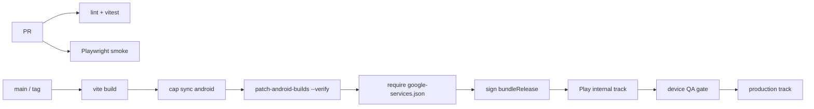

# Sociva Android Production Readiness Report

**Date:** 2026-08-01  
**Scope:** Investigation (Phases 1–14) plus **P0/P1 Capacitor Android hardening** (see §15–§16).  
**Workspace:** `sociva-v1-main`

---

## Executive Summary

| Item | Finding |
|------|---------|
| **Stack** | Vite + React 18 + TypeScript + Capacitor 8 + Supabase + TanStack Query. Confirmed via `package.json`, `capacitor.config.ts`, `android/`. |
| **What it is** | A **Capacitor WebView wrapper** around the same SPA shipped on web — not a Kotlin/Compose rewrite. Prefer hardening this stack over a native rewrite. |
| **Android maturity** | **Mid-stage scaffolding.** Project exists (`app.sociva.community`, targetSdk 36, minSdk 24), Codemagic `android-release` can produce an AAB, store listing assets and docs exist. Runtime native hardening is incomplete. |
| **Biggest Play Store blockers** | (1) Missing `google-services.json` → FCM push dead on Android. (2) App Links / deep-link native wiring incomplete (`assetlinks.json` placeholder; no HTTPS/`sociva` intent-filters in app manifest). (3) Privacy Policy understates **background location** used for seller delivery tracking. (4) No verified device QA for UPI deep-links + Razorpay Checkout inside Capacitor WebView. (5) Version / signing / Data Safety / Play publish path not production-closed. |

### Verdict

# **NO-GO** for Google Play production release

Ship is blocked until P0 items below are closed and a signed release build is exercised on physical Android devices for auth, push, UPI, and Razorpay. Conditional **Go** criteria are in §15.

---

## 1. Android Readiness Report

### Confirmed stack

| Layer | Evidence |
|-------|----------|
| Web | `vite`, `react`, `react-router-dom` (`HashRouter` in `src/App.tsx`) |
| Native shell | `@capacitor/android` ^8.0.2, `capacitor.config.ts`, `android/` |
| Backend | `@supabase/supabase-js`, edge functions under `supabase/functions/` |
| Data client | `@tanstack/react-query` with `networkMode: 'online'` |
| Payments | Admin-toggle `upi_deep_link` \| `razorpay` (`src/hooks/usePaymentMode.ts`) |
| Push | `@capacitor/push-notifications` + `@capacitor-community/fcm` + Firebase JS |
| Location | `@capacitor/geolocation` + `@transistorsoft/capacitor-background-geolocation` |

### Android project facts

| Setting | Value | Path |
|---------|-------|------|
| applicationId / namespace | `app.sociva.community` | `android/app/build.gradle` |
| minSdk / targetSdk / compileSdk | 24 / 36 / 36 | `android/variables.gradle` |
| versionCode / versionName | **1 / "1.0"** | `android/app/build.gradle` |
| package.json version | **0.0.0** | `package.json` |
| STORE_METADATA version | **2.0.0** | `STORE_METADATA.md` |
| MainActivity | Empty `BridgeActivity` subclass | `android/.../MainActivity.java` |
| Release minify | `minifyEnabled false` | `android/app/build.gradle` |
| App manifest permissions (app-level) | **Only `INTERNET`** | `android/app/src/main/AndroidManifest.xml` |
| Intent filters (app-level) | **LAUNCHER only** | same |
| `google-services.json` | **Missing** in `android/app/` and `android-config/` | workspace check 2026-08-01 |
| Production Capacitor mode | Bundled `dist`, `androidScheme: https`, `allowIntentUrls: true`, Razorpay domains in `allowNavigation` | `capacitor.config.ts` |

### Capacitor plugins wired (Gradle)

From `android/app/capacitor.build.gradle`: App, Browser, Camera, Geolocation, Haptics, Keyboard, Preferences, Push Notifications, Splash, Status Bar, FCM community, Calendar, Background Geolocation, Native Settings, Rate App.

### Maturity scorecard

| Area | Status |
|------|--------|
| Project / Gradle / targetSdk | Ready for builds |
| Icons / splash resources | Present under `android/app/src/main/res/` |
| Auth sticky session | Implemented (Preferences backup) |
| Push on Android | Code present; **config + device verification missing** |
| Deep links / App Links | JS handler present; **native + Digital Asset Links incomplete** |
| Payments on mobile | Logic hardened; **WebView/UPI runtime risk** |
| CI for AAB | Codemagic scripts exist |
| Play Console publish automation | **Not configured** (AAB emailed only) |
| Crash reporting (Android) | **Not evident** (Crashlytics only in iOS Podfile path) |

---

## 2. Mobile UX Review

### Strengths

- Safe-area aware chrome: `viewport-fit=cover` in `index.html`; headers/nav use `env(safe-area-inset-*)`.
- Splash auto-hide fail-safe (4s) in `src/lib/capacitor.ts` — reduces permanent black-screen risk.
- Persistent shell (`AppShell` / `BottomNav`) and HashRouter reduce refresh/deeplink 404s in WebView.
- Offline banner (`OfflineBanner` + `useNetworkStatus`).
- Razorpay overlay patched for safe-area / height (`useRazorpay.ts` MutationObserver) — shows awareness of WebView checkout UX pain.

### Gaps vs “native feel” (expected for Capacitor; ship-hardened, don’t rewrite)

| Gap | Evidence | Impact |
|-----|----------|--------|
| **No Android hardware back handler** | No `App.addListener('backButton'|…)` matches in `src/` | Back exits app or ignores sheet/stack expectations — Play review / UX failure |
| Hash routing | `HashRouter` in `src/App.tsx` | Works; URLs are `/#/…` — fine for Capacitor, awkward for marketing links |
| WebView scroll/keyboard | Capacitor Keyboard `resize: body` | Generally OK; complex forms/chat may still feel webby |
| Razorpay = injected web checkout | `checkout.razorpay.com/v1/checkout.js` | Not native SDK; overlays, UPI handoff, and dismiss races remain risk |
| UPI apps via `window.open(scheme://…)` | `UpiDeepLinkCheckout.tsx` | Not `Browser`/`App` intent APIs; package-visibility on Android 11+ may block discovery |
| Live Activities native code under `native/android/` | Not clearly integrated into Capacitor `MainActivity` | Feature may be iOS-first; Android parity unclear |

### Navigation / deep links (JS)

`src/hooks/useDeepLinks.ts` supports:

- `sociva://…`
- `https://www.sociva.in/#/…`
- Cold start via `App.getLaunchUrl()`
- Deferred nav via `sessionStorage` pending link

**But** app `AndroidManifest.xml` has **no** `VIEW` intent-filters for `https` App Links or `sociva` scheme. Without those (and valid `assetlinks.json`), Android will not deliver App Links into the activity.

---

## 3. Performance Review

### Positives

- **App bootstrap RPC** collapses static config into one round-trip with localStorage SWR (`src/lib/app-bootstrap.ts`) — important on mobile RTT.
- React Query defaults: `staleTime` 10m, `gcTime` 60m, `refetchOnWindowFocus: false` (`src/App.tsx`) — suitable for Capacitor.
- Resume path invalidates only lightweight keys (`cart-count`, unread notifications) in `useAppLifecycle.ts`.
- Production Capacitor loads **bundled** assets (not live Lovable URL) when `CAPACITOR_ENV` ≠ development.

### Risks

| Risk | Detail |
|------|--------|
| Cold start still network-bound | Auth restore + bootstrap + first feed still need connectivity |
| Background geolocation | High CPU/battery when sellers track deliveries (`useBackgroundLocationTracking.ts`) |
| Large SPA surface | Admin + marketplace + docs in one bundle — WebView memory on low-end devices |
| No Android R8 minify | `minifyEnabled false` — larger APK/AAB, slightly easier reverse-engineering |
| Transistorsoft dependency fragility | `scripts/patch-android-builds.cjs` required postinstall — build breaks if patch drifts |

---

## 4. Security Review

| Topic | Finding | Severity |
|-------|---------|----------|
| Supabase anon key in client | Expected; RLS must remain authoritative | Monitor |
| Auth tokens | localStorage + Preferences mirror (`capacitor-storage.ts`); `allowBackup="true"` on application | **High** — backup may expose tokens |
| Sticky auth restore | `restoreAuthSession` → `setSession`; 401 recovery before hard sign-out (`App.tsx`, `useAuthState.ts`) | Good |
| Razorpay keys | Checkout uses server-returned `razorpay_key_id` (`useRazorpay.ts`) — correct pattern | Good |
| WebView debugging | Disabled in production (`webContentsDebuggingEnabled: isDev`) | Good |
| Mixed content | Only in dev | Good |
| `allowNavigation` | Supabase + sociva + `*.razorpay.com` / `*.razorpay.in` | Needed for payments; keep tight |
| `allowIntentUrls: true` | Required for UPI/Razorpay intents | Necessary; validate no open redirect abuse |
| ProGuard rules | Empty/default `proguard-rules.pro` | Low while minify off |
| Account deletion | `DeleteAccountDialog` + `supabase/functions/delete-user-account` | Meets Play account-deletion expectation |
| Demo reviewer account | Documented in `DEPLOYMENT.md` | Useful for review |

---

## 5. Marketplace Mobile Review

### Commerce readiness (logic)

Recent payment-trust work is solid at the **business-rules** layer:

- UPI gated on `upi_verification_status === 'valid'` (`resolvePaymentConfig.ts`, `upi-deeplink-harden.test.ts`)
- Buyer UPI claim does not clear cart / does not fake “placed” (`UpiDeepLinkCheckout`, status honesty in `payment-trust-phases-2-5.test.ts`)
- Razorpay webhook fail-closed covered in unit/source contracts
- COD vs online resolved per fulfillment type

### Mobile-specific payment implications

| Path | How it works on Android | Risk |
|------|-------------------------|------|
| **UPI deep link (default mode)** | Builds `tez://`, `phonepe://`, `paytmmp://`, `upi://` and `window.open(..., '_blank')`; resumes via `visibilitychange` | Package visibility / WebView intent; resume race; screenshot+UTR friction on small screens |
| **Razorpay** | Loads Checkout.js inside WebView; DOM patched for overlay; `allowNavigation` for Razorpay hosts; `allowIntentUrls` for UPI inside Razorpay | Known Capacitor pain: blank checkout, stuck processing, double-callback; needs device matrix QA |
| **COD** | In-app status flow | Lowest mobile risk |

**Recommendation:** For first Play launch, prefer **Razorpay live** (or COD-heavy societies) only after device QA — or keep UPI deep-link but add Android `<queries>` for UPI packages and replace `window.open` with a Capacitor-safe open path. Do not assume web payment QA covers WebView.

### Seller mobile

- Camera/image upload paths exist (`@capacitor/camera`, upload components).
- Background GPS for delivery tracking is a **Play policy hot button** (see §7).

---

## 6. Offline Capability Review

| Capability | Status |
|------------|--------|
| Offline banner | Yes — `OfflineBanner` |
| Bootstrap cache | Yes — localStorage SWR up to 7 days max age |
| React Query persistence | **No** `persistQueryClient` — cache dies on process kill |
| `networkMode` | `'online'` — queries/mutations pause offline (correct for money ops) |
| Checkout guard | Blocks when `!navigator.onLine` (`useCartPage.ts`) |
| True offline browsing / cart sync | **Not production-grade offline-first** |

**Honest assessment:** Graceful degradation + cached config, not an offline marketplace. Acceptable for v1 if messaging matches (“needs connection to order”).

---

## 7. Google Play Compliance Report

### Listing / assets

| Asset | Status |
|-------|--------|
| 512 icon | `public/android-chrome-512x512.png` |
| Feature graphic | `public/feature-graphic.png` |
| Store copy | `STORE_METADATA.md` |
| Screenshots guide | `SCREENSHOTS_GUIDE.md` (device screenshots still operator work) |
| Privacy / Terms in-app | `/#/privacy-policy`, `/#/terms` |
| Account deletion | Present |

### Data Safety / policy red flags

1. **Background location**  
   - Code: `@transistorsoft/capacitor-background-geolocation` + `useBackgroundLocationTracking.ts` (seller delivery).  
   - Privacy copy (fallback): *“Location data is used solely for verification and is not continuously tracked.”* (`PrivacyPolicyPage.tsx`)  
   - **Mismatch** with actual continuous tracking during deliveries. Play requires accurate Data Safety form, prominent in-app disclosure, and often a video for background location. iOS plist already describes background delivery use; Android privacy text does not.

2. **Push notifications**  
   - Runtime permission `POST_NOTIFICATIONS` (Android 13+) via Capacitor plugin annotations — must be declared accurately in Data Safety.

3. **App Links**  
   - `public/.well-known/assetlinks.json` still has `SHA256_FINGERPRINT_PLACEHOLDER` — **invalid** for verified App Links.

4. **Permissions surface**  
   - App manifest currently lists only `INTERNET`. Capacitor plugins declare permissions via annotations / merge; release APK must be inspected (`aapt dump permissions`) and Play declarations must match **camera, precise location, background location, notifications, etc.**

5. **Payments**  
   - UPI / Razorpay / COD; ensure Play payments policy for physical goods / local services is satisfied (India marketplace — typically OK if not selling digital goods that require Play Billing).

6. **Version identity**  
   - Play expects monotonic `versionCode`; repo still at `1` / `"1.0"` while marketing docs say `2.0.0`.

### Pre-submission docs optimism

`PRE_SUBMISSION_CHECKLIST.md` / `DEPLOYMENT.md` mark deep linking and push as done. **Code/config evidence does not fully support Android readiness** (missing Firebase JSON, placeholder assetlinks, incomplete intent-filters). Treat those checklists as aspirational, not verified.

---

## 8. Crash Risk Assessment

| Risk | Likelihood | Notes |
|------|------------|-------|
| Splash hang | Mitigated | 4s force-hide |
| Auth session loss on WebView storage purge | Mitigated | Preferences backup + setSession |
| Missing Firebase plugin / null messaging | High if JSON absent | `build.gradle` logs and skips google-services |
| Razorpay script/WebView crash or stuck UI | Medium–High | Multiple guards; still needs device proof |
| UPI intent failure / no app opens | Medium | No `<queries>`; `window.open` |
| Background geolocation OEM kills | Medium | Transistorsoft helps; battery OEM variance |
| Hardware back on payment sheet | Medium | No back handler — user may kill checkout mid-flow |
| No Android Crashlytics/Sentry | High ops impact | Blind production crashes |
| Plugin Gradle patch failure | Medium on CI | Codemagic verifies patch |

Overall crash/ops posture: **web-layer ErrorBoundary exists; native Android crash pipeline is weak.**

---

## 9. Missing Production Requirements

1. `android-config/google-services.json` (and verified FCM on a physical Android device).  
2. Release keystore + SHA-256 in `assetlinks.json` (replace placeholder).  
3. Manifest: App Links + custom scheme intent-filters; UPI `<queries>`; explicit dangerous permissions aligned with Play form.  
4. Hardware back-button strategy (nav stack / dismiss sheets / double-back-to-exit).  
5. Privacy Policy + Data Safety aligned with **background location** and push.  
6. Align `versionName` / `versionCode` with store metadata.  
7. Consider `android:allowBackup="false"` (or encrypted/excluded auth keys).  
8. Android crash reporting (Firebase Crashlytics or equivalent).  
9. Device QA matrix: auth OTP, sticky resume, push tap → route, UPI GPay/PhonePe/Paytm, Razorpay UPI, camera listing, seller GPS.  
10. Play Console listing completion (content rating, Data Safety, photos, target audience).  
11. Codemagic → Play internal/closed track publish (currently AAB + email only).  
12. Confirm live Razorpay keys and webhook URL for production package / domains.

---

## 10. Regression Risk Report

| Change area | Regression risk if touched pre-ship |
|-------------|-------------------------------------|
| Push (`PUSH_NOTIFICATION_FREEZE.md`) | **Very high** — frozen after iOS verification; Android unproven |
| Sticky auth / Preferences | High — silent logout storms |
| Payment mode toggle / UPI harden / Razorpay webhook | High — money path; unit tests help but not WebView |
| Capacitor config `allowNavigation` / `allowIntentUrls` | High — can break checkout or open phishing surface |
| `patch-android-builds.cjs` / Transistorsoft | High — CI/build break |
| HashRouter / deep link parser | Medium — notification routing |
| Bootstrap RPC shape | Medium — blank home if contract drifts |

**Safe pre-ship work:** manifest/config, Firebase file, privacy copy, versionCode, CI Play upload, device QA — not broad refactors.

---

## 11. Prioritized Implementation Plan

### P0 — Blockers (must before production Play)

| # | Item | Effort | Owner hint |
|---|------|--------|------------|
| P0-1 | Add `google-services.json`; prove FCM receive + tap-through on Android 13/14 device | 1–2 d | Mobile + backend |
| P0-2 | Fix Digital Asset Links + add App Link / `sociva` intent-filters; verify `adb` deep link | 1 d | Mobile |
| P0-3 | Align Privacy Policy + Play Data Safety + in-app disclosure for **background location**; prepare Play declaration | 1–2 d | Legal/product + eng |
| P0-4 | Android payment device QA: UPI schemes + Razorpay Checkout; add `<queries>` / safer open if UPI fails | 2–3 d | Mobile + QA |
| P0-5 | Hardware back button handling for root / sheets / checkout | 0.5–1 d | Mobile |
| P0-6 | Release signing, bump versionCode/Name, signed AAB smoke install | 0.5 d | Release eng |

### P1 — Strongly recommended before broad rollout

| # | Item | Effort |
|---|------|--------|
| P1-1 | `allowBackup` hardening for auth storage | 0.5 d |
| P1-2 | Firebase Crashlytics (or Sentry) on Android | 1 d |
| P1-3 | Codemagic publish to Play **internal** track | 0.5–1 d |
| P1-4 | Replace UPI `window.open` with Capacitor Browser / intentional intent plugin | 1–2 d |
| P1-5 | Dump merged manifest permissions; sync Play Console declarations | 0.5 d |
| P1-6 | Playwright remains web-only — add Maestro/Detox or manual gate checklist in CI release notes | 1–2 d |

### P2 — Post-launch hardening

| # | Item | Effort |
|---|------|--------|
| P2-1 | R8 minify + keep rules for Capacitor/Razorpay | 1–2 d |
| P2-2 | React Query persistence for read-only caches | 1–2 d |
| P2-3 | Reduce WebView “webby” feel (haptics audit, transitions already partial) | ongoing |
| P2-4 | Evaluate native Razorpay Android SDK only if Checkout.js fail rate high | 1–2 w |
| P2-5 | Android Live Delivery parity if product requires it | multi-week |

**Rewrite?** Not recommended. Gaps are wrapper/config/policy/QA — not a signal to abandon Capacitor for v1.

---

## 12. Testing Strategy

### Already present

- Vitest: sticky auth, UPI harden, payment trust phases, Razorpay DOM helpers, commerce smoke contracts (`src/test/*`).
- Playwright e2e (web): `.github/workflows/e2e.yml` smoke on PR, full nightly.
- Codemagic: web build → `cap sync` → `bundleRelease` with patch verify.

### Required for Android Go

1. **Manual / device lab (blocking)**  
   - Cold start, kill-reopen sticky auth  
   - OTP login (MSG91 path) on cellular  
   - Push foreground/background/killed + deep link route  
   - UPI: GPay, PhonePe, Paytm round-trip + proof submit  
   - Razorpay: card + UPI + dismiss + success webhook → order state  
   - Camera product photo; location geofence signup; seller background track start/stop  
   - Hardware back on home, PDP, cart sheet, payment drawer  

2. **Automation (near-term)**  
   - Keep Vitest + Playwright for logic/web.  
   - Add release checklist artifact; optional Maestro flows for login + open cart.  

3. **Store**  
   - Internal testing track → closed → production.  
   - Use documented demo account for reviewers (`DEPLOYMENT.md`).

---

## 13. CI/CD Pipeline (Proposed)

Current: GitHub Actions = web E2E only; Codemagic builds iOS (TestFlight) + Android AAB (email), **no Play upload**.

**Proposed Codemagic additions**

- Fail build if `android-config/google-services.json` missing (today: WARNING only).  
- `publishing.google_play` → internal track.  
- Tag-driven `versionCode` from CI.  
- Optional: upload mapping files when R8 enabled later.

---

## 14. Production Release Checklist

### Build & identity

- [ ] `CAPACITOR_ENV` unset or production; no Lovable live-reload server block  
- [ ] `npm run build` + `npx cap sync android`  
- [ ] `google-services.json` present; google-services plugin applied  
- [ ] Signing keystore secured; SHA-256 in Firebase + `assetlinks.json`  
- [ ] `versionCode` incremented; `versionName` matches store  

### Native manifest / policy

- [ ] Intent-filters for App Links + custom scheme  
- [ ] UPI package `<queries>`  
- [ ] Merged permissions reviewed vs Play Data Safety  
- [ ] Privacy Policy mentions delivery background location  
- [ ] Background location Play form + prominent disclosure  

### Product verification (devices)

- [ ] Auth sticky across force-stop  
- [ ] Push delivered + notification open route  
- [ ] Deep link cold/warm start  
- [ ] UPI + Razorpay money paths  
- [ ] Hardware back behavior acceptable  
- [ ] Account deletion works end-to-end  
- [ ] Offline banner only — no false “order placed” offline  

### Store

- [ ] Listing, feature graphic, phone screenshots  
- [ ] Content rating questionnaire  
- [ ] Internal track smoke by non-dev  
- [ ] Support email / privacy URL reachable  

---

## 15. Go / No-Go Recommendation

# **NO-GO** — do not submit to Play production until user/Firebase/device gates below are closed.

Code hardening for P0/P1 (Capacitor wrapper) was applied on **2026-08-01**. Remaining blockers are **operator** actions (Firebase JSON, live Asset Links SHA-256, signing keystore, Play Data Safety, physical device QA).

### Implementation status (code vs user action)

| Item | Status | Notes |
|------|--------|-------|
| **P0-1** FCM / `google-services.json` | **Needs user action** | Example + README at `android-config/`; Gradle already applies plugin when JSON present; push fails closed without Firebase. **User:** download real JSON → `android-config/` + `android/app/`. |
| **P0-2** App Links + `sociva://` | **Done (code)** / **Needs user action (SHA)** | Manifest intent-filters + `autoVerify`; deep-link parser hardened. Replace `TODO_REPLACE_SHA256` in `assetlinks.json` and deploy to www.sociva.in. |
| **P0-3** Privacy + background location disclosure | **Done (code)** / **Needs Play form** | Privacy fallback copy + in-app AlertDialog before tracking. Complete Play Data Safety (`docs/ANDROID_PLAY_DATA_SAFETY.md`). If DB overrides privacy MD, update that too. |
| **P0-4** Payments Android | **Done (code)** / **Needs device QA** | `<queries>` for UPI; `Browser.open` path; `docs/ANDROID_PAYMENT_QA.md`. |
| **P0-5** Hardware back | **Done** | `useAndroidBackButton` — dismiss overlays → history → double-back minimize. |
| **P0-6** Version + signing stubs | **Done (code)** / **Needs keystore** | `versionCode` 2 / `versionName` `2.0.0`; `keystore.properties.example`; `docs/ANDROID_SIGNING.md`. |
| **P1-1** `allowBackup="false"` | **Done** | Manifest hardened. |
| **P1-2** Crashlytics Gradle | **Done (stub)** | Plugin + dep apply only when `google-services.json` present. |
| **P1-3** Codemagic → Play track | **Not done** | Still email AAB only. |
| **P1-4** UPI via Browser | **Done** | Covered under P0-4. |
| **P1-5** Data Safety docs | **Done** | `docs/ANDROID_PLAY_DATA_SAFETY.md`. |

### Why still NO-GO for production

Without a real Firebase Android config, verified Asset Links on the live domain, a secured release keystore, Play Console Data Safety (incl. background location + video), and signed device QA for UPI/Razorpay/push, a production submission remains high risk.

### Conditions for **Go** (all required)

1. Firebase Android config installed and **push proven on device**.  
2. Valid `assetlinks.json` (real SHA-256) deployed + working App Links / scheme filters.  
3. Privacy + Data Safety **honest about background location**; Play declarations complete.  
4. Signed AAB with coherent versioning; internal-track install smoke passed.  
5. Device QA sign-off on **sticky auth, back button, UPI, and Razorpay** (`docs/ANDROID_PAYMENT_QA.md`).  
6. Crashlytics active in release builds (requires google-services.json).

### After Go

Prefer **staged rollout** (internal → 5–20% production) and monitor payment success rate and ANRs for 72 hours before 100%.

---

## 16. Implementation status summary (2026-08-01 code pass)

### Shipped in repo

- Android App Link + custom-scheme intent-filters; UPI `<queries>`; `allowBackup="false"`
- Deep-link resolution for hash + path-style URLs; launch URL + `appUrlOpen`
- UPI open via `@capacitor/browser` with WebView fallbacks
- Hardware back-button handler (Android only)
- Privacy policy + in-app background-location disclosure
- Version `2.0.0` / versionCode `2`; signing property stubs; Crashlytics Gradle wiring (gated on Firebase JSON)
- Docs: `android-config/README.md`, `docs/ANDROID_PAYMENT_QA.md`, `docs/ANDROID_PLAY_DATA_SAFETY.md`, `docs/ANDROID_SIGNING.md`, Asset Links README

### User / ops must still do

1. Download **real** `google-services.json` into `android-config/` and `android/app/`
2. Create release keystore → set `android/keystore.properties` (gitignored) → bump `versionCode` on each upload
3. Put **release (+ Play App Signing)** SHA-256 into `assetlinks.json` and deploy to **www.sociva.in**
4. Fill Play Console **Data Safety** per `docs/ANDROID_PLAY_DATA_SAFETY.md` (background location + disclosure video)
5. Run physical-device QA (`docs/ANDROID_PAYMENT_QA.md`)
6. Build AAB: `npm run build && npx cap sync android && cd android && ./gradlew bundleRelease`

---

## Appendix A — Key file index

| Concern | Paths |
|---------|-------|
| Capacitor config | `capacitor.config.ts` |
| Android manifest / Gradle | `android/app/src/main/AndroidManifest.xml`, `android/app/build.gradle`, `android/variables.gradle` |
| Auth storage | `src/lib/capacitor-storage.ts`, `src/contexts/auth/useAuthState.ts` |
| Lifecycle / resume | `src/hooks/useAppLifecycle.ts` |
| Deep links | `src/hooks/useDeepLinks.ts` |
| Push | `src/hooks/usePushNotifications.ts`, `src/PUSH_NOTIFICATION_FREEZE.md` |
| UPI | `src/components/payment/UpiDeepLinkCheckout.tsx` |
| Razorpay | `src/hooks/useRazorpay.ts`, `src/components/payment/RazorpayCheckout.tsx` |
| Payment mode | `src/hooks/usePaymentMode.ts`, `src/lib/resolvePaymentConfig.ts` |
| Bootstrap / offline | `src/lib/app-bootstrap.ts`, `src/components/network/OfflineBanner.tsx` |
| Privacy | `src/pages/PrivacyPolicyPage.tsx` |
| Asset Links | `public/.well-known/assetlinks.json` |
| CI | `.github/workflows/e2e.yml`, `codemagic.yaml` |
| Store docs | `STORE_METADATA.md`, `PRE_SUBMISSION_CHECKLIST.md`, `DEPLOYMENT.md` |

## Appendix B — Native feel vs rewrite

Sociva is a **feature-rich Capacitor SPA**. Remaining “native feel” gaps (back button, system sharesheets, perfect payment SDK, jank on low-end WebViews) are normal. Closing P0/P1 above is far cheaper and lower risk than a Kotlin rewrite. Revisit native modules only for **payments SDK** or **live tracking UX** if metrics demand it after launch.
