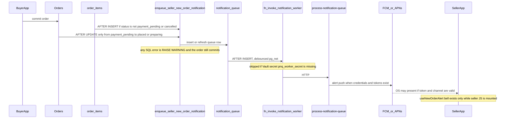

# Sociva seller order notification reliability audit

Date: 2026-10-10
Scope: repository evidence only
Status: audit complete, no code or production changes made
Recommendation: no-go for treating the current design as reliable seller awareness

This report traces how a committed order is supposed to reach a seller and make a sound. It does not claim that production delivery was measured. Sections marked UNVERIFIED were not executed because the required device, Firebase, APNs, or production database access was not used in this audit.

A successful provider HTTP response is not device receipt. A visible notification is not proof the bell was heard. A clean reading of the source is not proof of 100 percent future delivery.

## 1. Executive summary

Sociva has two seller-alert paths, and they are not equivalent.

The bell sellers hear while the app is open is started by JavaScript in `useNewOrderAlert`. That hook subscribes to Realtime, polls, plays `/sounds/gate_bell.mp3` in the WebView, and schedules a Capacitor local notification. None of that runs after the seller process is gone. This matches the production complaint: sellers notice orders when Sociva stays open.

A second path is server-originated. An order commit is supposed to insert a `notification_queue` row, wake the `process-notification-queue` Edge Function, and send an FCM or APNs alert. That path can run while the seller app is closed, but only if a durable queue row exists, a wake-up actually runs, a current device token exists, and the payload asks for a sound the OS can play. Several code paths drop or silence that alert without failing the order.

Current reliability assessment: the in-app bell is real and stops when the app stops. The remote path is designed to survive a closed app, but the repository shows silent drops (swallowed enqueue errors, no-token rows marked processed, auto-accepted orders not marked high priority, best-effort wake-ups). Production queue health, token coverage, cron execution, Vault secret presence, and physical sound were not measured here.

## 2. Existing architecture

Provider in the current source: FCM HTTP v1 for Android tokens, and direct APNs for iOS when an `apns_token` and APNs credentials exist. Capacitor Push Notifications plus `@capacitor-community/fcm` register the device. There is also an in-app HTML audio bell. WhatsApp is a side channel inside the same queue worker and is not a substitute for the bell.

## 3. End-to-end sequence

| Step | What happens | Where | Silent failure |
| --- | --- | --- | --- |
| 1. Buyer submits | Checkout commits an order. This audit did not re-test checkout. | Buyer cart and order RPCs | UNVERIFIED at runtime |
| 2. Order commits | Row is stored with `seller_id`. | `public.orders` | Commit can succeed even if notification enqueue throws |
| 3. Notification obligation | `enqueue_seller_new_order_notification` inserts `notification_queue`. | `supabase/migrations/20260822150000_fix_new_order_notification_trigger.sql` | Exception handler warns and returns. No queue row. |
| 4. Trigger | No INSERT trigger remains on `orders`. Enqueue runs after `order_items` insert, or after status moves from `payment_pending` to `placed` or `preparing`. | Same migration, triggers at the bottom of the file | Item insert while status is still `payment_pending` returns without enqueue. A later status update is required. |
| 5. Wake | `trg_process_notification_queue` calls `fn_invoke_notification_worker`. Debounced to one HTTP per 2 seconds. | `supabase/migrations/20260808052915_fix_notification_worker_scheduler_auth.sql` | Missing Vault secret logs a warning and skips. pg_net failure is caught and must not roll back the queue insert. |
| 6. Safety net | pg_cron job `wakeup_notification_queue_if_pending` every 10 minutes, if that migration is applied. | `supabase/migrations/20260807141834_perf_p0_pnq_debounce_and_hot_rls.sql` | UNVERIFIED that the job exists in production. 10 minutes is a long gap. |
| 7. Client wake | Open buyer flows call `process-notification-queue` and ignore the error. | `src/hooks/useCartPage.ts` and other callers | If the buyer app dies after commit and the server wake failed, dispatch waits for cron. |
| 8. Seller and tokens | Queue `user_id` is `seller_profiles.user_id` for `orders.seller_id`. Worker reads `device_tokens` for that user. | Enqueue function and `process-notification-queue` | Null seller user returns with no row. No tokens marks the row processed. |
| 9. Push | FCM `messages:send` and/or APNs `api.push.apple.com` with `apns-push-type: alert` and priority 10. | `supabase/functions/process-notification-queue/index.ts` | Timeout is 5 seconds per push. Missing credentials mark processed with `no_credentials`. |
| 10. Sound request | High priority uses Android channel `orders_incoming_v2` and sound `gate_bell`. iOS sound is `gate_bell.mp3`. Otherwise sound is `default`. | Same function, `sendFcmDirect` and `sendApnsDirect` | `preparing` is not high priority, so auto-accepted orders do not request the custom bell and can be dropped in quiet hours. |
| 11. OS presentation | The OS shows the alert only if permission, channel, and token are valid. | Native OS | UNVERIFIED on devices. Android force-stop can suppress delivery until the app is opened. |
| 12. Heard bell | In-app loop is `useNewOrderAlert`. Remote sound depends on the OS channel and a bundled file. | `src/hooks/useNewOrderAlert.ts` | App closed: in-app bell does not run. Missing sound file: notification can be silent. |
| 13. Recovery | All-token failures retry every 15 seconds, up to 9 attempts, then dead letter. No-token and swallowed enqueue do not retry. | Queue worker | No seller acknowledgment escalation. |

Correlation: queue row id, `idempotency_key` = md5(order id + `-new_order-` + status), payload `orderId`, and `pnqLog` JSON lines. There is no single trace id from checkout through device presentation.

## 4. Source and configuration references

- In-app bell and Realtime: `src/hooks/useNewOrderAlert.ts`
- Local notification schedule: `src/lib/local-order-notifications.ts`
- Foreground push handler and Android channels: `src/hooks/usePushNotifications.ts`
- Channel id constants: `src/lib/notification-channel-settings.ts`
- Token save: `claim_device_token`, fallback `device_tokens` upsert, then `syncInstallationPermissions` in `src/lib/installation.ts`
- Enqueue and triggers: `supabase/migrations/20260822150000_fix_new_order_notification_trigger.sql`
- Older enqueue that used `ON CONFLICT ON CONSTRAINT`: `supabase/migrations/20260809220000_notification_queue_idempotency.sql`
- Queue worker: `supabase/functions/process-notification-queue/index.ts`
- Shared quiet hours, logs, dead letter: `supabase/functions/_shared/notification-ops.ts`
- Wake-up auth: `supabase/migrations/20260808052915_fix_notification_worker_scheduler_auth.sql`
- Cron definition: `supabase/migrations/20260807141834_perf_p0_pnq_debounce_and_hot_rls.sql`
- iOS and Android sound copy step: `codemagic.yaml` copies `ios-config/gate_bell.mp3` only if the file exists
- Capacitor presentation sound hint: `capacitor.config.ts`

Workspace search found no `gate_bell.mp3` and no `public/sounds` assets. Whether CI has `ios-config/gate_bell.mp3` is UNVERIFIED.

## 5. Why sellers may only hear orders while Sociva is open

Confirmed in source, not by a device recording:

1. The repeating bell is mounted with the seller UI. `useNewOrderAlert` opens a Realtime channel and a poll timer in a `useEffect`. When the process is killed, both stop. The hook also ignores orders created before mount when they are older than 5 minutes, so opening the app later does not replay the bell for those orders.
2. The HTML audio element loads `/sounds/gate_bell.mp3` inside the WebView. That playback cannot run in a terminated app.
3. `scheduleIncomingOrderLocalNotification` is called from that same hook and from the foreground push listener. Both require the JavaScript runtime. The file comment says the local notification is for foreground and app-open ringing.
4. Remote push is a separate mechanism and does not depend on the seller app staying open. It does depend on a queue row, a successful wake, a live token, and an OS-accepted alert payload. Those conditions are not guaranteed by the code paths below.
5. If the seller has no `device_tokens` row, the worker sets the queue item to `processed` with `push_skip_reason = no_tokens`. It does not stay pending until a token appears.
6. `upsert_app_installation` failing, as seen in a browser console (`Could not find the function public.upsert_app_installation`), is logged and ignored. The push registration comment says delivery still uses `device_tokens`. That console line alone does not prove the FCM token was lost. It does prove the installation analytics RPC is absent from the production schema cache. UNVERIFIED whether `claim_device_token` succeeded for the same session.

Rejected as the only explanation: "there is no server push." The Edge Function builds alert payloads for FCM and APNs. The defect is that the closed-app path can be skipped or silenced, while the open-app path is the one that actually rings.

Not rejected, still UNVERIFIED in production: Vault secret missing, cron not scheduled, FCM credentials absent, tokens invalid, channel muted, or the sound file absent from the store build.

## 6. Confirmed defects versus hypotheses

Confirmed from the repository (the production database may differ if migrations were not applied):

- In-app bell dies with the process.
- Enqueue exceptions do not fail the order.
- Order INSERT no longer enqueues by itself.
- `preparing` is not a seller high-priority status.
- No tokens, no credentials, quiet hours, and non-urgent rate limits mark the queue row processed.
- Retry delay is a fixed 15 seconds, not exponential backoff with jitter.
- Provider acceptance updates a delivered audit RPC best-effort and is not device or sound proof.
- Android channels are created only when the app runs, and channel sound cannot be changed later without a new channel id.
- Foreground handler can skip the local bell.

Hypotheses, UNVERIFIED:

- Production Vault `pnq_worker_secret` is missing, so insert wake-ups never fire.
- Production cron job is absent or failing.
- Installed APK or IPA does not contain `gate_bell`.
- Sellers' `device_tokens` rows are stale or empty.
- The migration `20260822150000` is not what production is running, so an older `ON CONFLICT ON CONSTRAINT` function is still live and throws.

## 7. Severity

### P0

**F-1. The bell sellers recognize runs only while the seller app process is alive.**

- Component: `src/hooks/useNewOrderAlert.ts`, `src/lib/local-order-notifications.ts`
- Impact: background, swiped away, and terminated states do not run the loop. This is the complaint.
- Evidence: Realtime subscription and poll live in `useEffect`. Audio uses WebView URLs. Local notifications are scheduled from that hook.
- Correction later: keep a server alert with a bundled sound as the closed-app bell. Do not treat the JS loop as the reliability path.

**F-2. A committed order can have no notification row.**

- Component: `enqueue_seller_new_order_notification` and both triggers in `20260822150000_fix_new_order_notification_trigger.sql`
- Impact: the order exists and the seller is not owed a recoverable push.
- Evidence: `EXCEPTION WHEN OTHERS THEN RAISE WARNING`. INSERT trigger on `orders` is dropped. Item trigger returns immediately when status is `payment_pending` or `cancelled`.
- Correction later: enqueue in the same transaction as the commit, without swallowing the error into success, or write an outbox row that cannot be skipped.

**F-3. Missing tokens are treated as finished work.**

- Component: `process-notification-queue` around the `successCount > 0 || failCount === 0` branch
- Impact: a seller who has not registered a token, or whose tokens were pruned, never gets a later push for that order.
- Evidence: `push_skip_reason` `no_tokens` sets `status = processed`.
- Correction later: leave the row pending or failed until a token exists or a human escalation fires. Do not call that delivered.

**F-4. Auto-accepted orders do not request the order bell.**

- Component: `SELLER_HIGH_PRIORITY_STATUSES` in `process-notification-queue`
- Impact: status `preparing` uses the default sound and can be suppressed by quiet hours or the non-urgent rate limit.
- Evidence: the list is `placed`, `enquired`, `requested`, `quoted`, `payment_verify_pending`, `refund_requested`. The enqueue path explicitly allows `preparing` as a new-order status.
- Correction later: treat a new seller order in `preparing` as high priority.

### P1

**F-5. Android sound depends on a channel created at runtime and a raw file that is not in the workspace.**

- Component: `usePushNotifications.ts` `createChannel` for `orders_incoming_v2`, `codemagic.yaml`
- Impact: Android channel settings are immutable. If the first create used a missing `gate_bell` resource, that install stays silent on that channel until a new channel id ships and the app runs. Push sent before the app has ever created the channel may not use the intended sound.
- Evidence: channel create runs inside the push setup effect. Codemagic copies `ios-config/gate_bell.mp3` only when the file exists. Workspace search found no such file.
- Device result: UNVERIFIED.

**F-6. Foreground handling can hide the alert.**

- Component: `pushNotificationReceived` in `usePushNotifications.ts`
- Impact: Live Activity tracking returns early. An open order page returns early. A haptic in the last 3 seconds shows a toast and returns before the local bell.
- Evidence: those three branches are in the listener. They run only when the app is in the foreground, so they do not explain a killed app, but they do explain a missed bell while the seller is already in the app.

**F-7. Wake-up is best effort.**

- Component: `fn_invoke_notification_worker`, cron `*/10 * * * *`
- Impact: if the Vault secret is missing, the insert trigger does not call the worker. The safety cron, if present, waits up to 10 minutes. Buyer `.catch(() => {})` calls do not surface failure.
- Production cron and Vault: UNVERIFIED.

**F-8. Older idempotency SQL can throw.**

- Component: `20260809220000_notification_queue_idempotency.sql` uses `ON CONFLICT ON CONSTRAINT idx_notification_queue_idempotency` on a unique index.
- Latest intended function uses `ON CONFLICT (user_id, idempotency_key) WHERE idempotency_key IS NOT NULL`, which matches a partial unique index.
- Impact if the old function is still deployed: enqueue throws, the exception is swallowed, no notification.
- Which function production runs: UNVERIFIED.

**F-9. Installation RPC missing in production schema cache.**

- Component: `src/lib/installation.ts` `upsert_app_installation`
- Evidence: a live browser console reported the function was not in the schema cache. This audit did not re-query the database.
- Impact on push: not proven. Token delivery is coded against `device_tokens`. The failed RPC still means installation permission state is not saved.

### P2

**F-10. Retries are short, fixed, and easy to exhaust.**

- 15 second delay, 9 attempts, then `notification_dead_letter`. No jitter. A provider outage longer than a few minutes dead-letters the order alert.
- Permanent token errors and transient network errors share the same counter.

**F-11. No seller acknowledgment escalation.**

- Nothing in this path re-alerts another device or channel because the seller has not accepted the order. Push acceptance is not an acknowledgment.

### P3

**F-12. Thread id is the order id.**

- APNs `apns-collapse-id` and Android `tag` use the order id. Separate orders should not collapse into each other. Updates for the same order can replace the previous alert. That is acceptable for one order and must not be used across orders.

**F-13. Stale push downgrade.**

- Foreground handler treats payload `created_at` older than 10 minutes as stale and skips sound. A delayed but still unaccepted order can arrive silently while the app is open.

## 8. Android and iOS, from code only

No physical device, emulator sound check, or OS version was recorded. Every row below is a code expectation, not a test result.

| State | Android expectation from code | iOS expectation from code | Evidence level |
| --- | --- | --- | --- |
| App open | JS bell plus local notification plus foreground push handler | JS bell plus local notification. Custom sound name `gate_bell.mp3` | Code only |
| Background, process alive | OS may show the FCM alert if the channel exists | OS may show the APNs alert | UNVERIFIED |
| Swiped away | Remote alert can still arrive. JS bell cannot. | Remote alert can still arrive after a normal quit. JS bell cannot. | UNVERIFIED |
| Explicit force-stop | Android can block FCM until the user opens the app again. Do not claim otherwise. | Swiping away from the app switcher is not the same as Android force-stop. A normal alert can still be shown. Silent pushes cannot be relied on. | OS documented behavior, not tested here |
| Locked screen | Depends on channel visibility and OS settings | Depends on alert permission and Focus | UNVERIFIED |
| Reboot | Token remains in `device_tokens` until pruned. Channel remains. JS bell does not resume until launch. | Same for token. JS bell does not resume. | UNVERIFIED |
| Permission denied | No OS alert. In-app bell still needs the process. | No OS alert. | UNVERIFIED |
| Channel or sound disabled | Android channel mute is sticky. App cannot override it. | Sounds can be off while banners stay on. | UNVERIFIED |
| Token refresh | `registration` listener saves a new token when the app runs | iOS saves FCM token from the FCM plugin and APNs token when both exist. FCM failure can save the APNs token as the FCM token. | Code only |
| Multiple devices | Worker sends to tokens for the user. Invalid tokens are marked after failures. | Same | UNVERIFIED how many tokens production keeps |
| Upgrade | New channel id `orders_incoming_v2` applies only after the new build runs once | New binary must contain `gate_bell.mp3` | Build artifact UNVERIFIED |

Android force-stop versus swipe-away was not tested. This audit does not claim push is delivered after an explicit force-stop.

## 9. Audible bell, separate from push delivery

The intended custom sound is `gate_bell`, not the OS default, for high-priority seller orders.

- Payload: high priority sets Android `sound: gate_bell` and `channel_id: orders_incoming_v2`, and iOS `sound: gate_bell.mp3`. Non-high-priority uses `default`.
- Asset: not present in the workspace. CI copies it from `ios-config/gate_bell.mp3` if that path exists at build time. Android expects `res/raw/gate_bell` without the extension. iOS expects the file in the app bundle with the `.mp3` suffix. A name or capitalization mismatch plays no custom sound.
- Channel: created in JavaScript on Android after launch. Importance 5, vibration on. Legacy channels `orders_incoming_v1` (`order_ring`) and `orders_alert` are also created. An older install that created a channel without the file keeps that silent sound.
- Foreground: the system alert is not a reliable bell because the listener may return before `scheduleIncomingOrderLocalNotification`. The HTML audio path also requires the WebView.
- Duplicates: Realtime and the push listener can both schedule the same local notification id (hash of the order id), which replaces rather than stacks. The JS bell loop is separate and can overlap the OS sound while the app is open.
- Several orders: each order id is its own local notification id and its own push thread id. The JS loop still walks one alert at a time.
- Volume, Focus, silent switch, and a muted channel can block sound even when the provider accepted the push. That cannot be proven from a server log.

Acceptance: this audit does not report the bell as working. No device was listened to.

## 10. Supabase, FCM, APNs, Capacitor

- Database trigger is `AFTER` the row or item insert, so it sees committed data within the same transaction. A thrown exception inside the trigger is caught, so the order transaction still commits. That protects checkout and drops the alert.
- Edge Function timeouts and cold starts: UNVERIFIED in logs. The function uses a 5 second push timeout. A crash after commit and before the queue insert is possible only if enqueue is skipped, because enqueue is in the database transaction when the trigger runs.
- There is a queue table, idempotency key, dead letter, and retry. That is a partial outbox. It is not a transactional guarantee that every committed order has a pending obligation, because enqueue errors are swallowed and several skip reasons mark the row processed.
- RLS and service role inside the worker: UNVERIFIED against production policies. The worker uses a service client in the function source.
- Seller routing uses `seller_profiles.user_id` for `orders.seller_id`. A store whose profile has no user id gets no queue row (`RETURN` before insert).
- Tokens: `claim_device_token` then `device_tokens` upsert on `user_id,token`. Multiple devices can exist. Health score marks a token invalid after repeated failures or `INVALID_TOKEN`. Logout behavior was not fully traced in this audit.
- FCM project id and APNs key, team id, and bundle id come from credentials inside the function. Whether production credentials match `app.sociva.community` and the App Store or TestFlight environment is UNVERIFIED. This audit did not open Firebase Console or Apple Developer.
- Capacitor registers on app launch when the push provider is mounted. Registration does not run in a killed process. A reinstall needs a new registration before remote push can target that install.
- `send-campaign` uses sound `default` and channel `general`. That is a different path from order alerts.

## 11. Test matrix and execution evidence

Executed in this audit: source inspection of the files listed above, plus the previously observed browser console line that `upsert_app_installation` is missing from the schema cache.

Not executed: every Android and iOS state, network shaping, provider failure injection, concurrent orders, multi-device delivery, sound observation, and production SQL.

| Area | Planned check | Result |
| --- | --- | --- |
| App open, seller UI mounted | JS bell and local notification code paths exist | Code confirmed. Not heard. |
| App killed | JS bell cannot run. Remote push is the remaining path. | Code confirmed. Not delivered to a device. |
| Android force-stop | OS may suppress FCM until next launch | Not tested. Not claimed as delivered. |
| iOS terminated | Alert payload is `apns-push-type: alert`, not a silent push | Code confirmed. Not observed on a phone. |
| No device token | Queue row marked processed | Code confirmed. Production row counts UNVERIFIED. |
| Auto-accepted `preparing` | Not high priority | Code confirmed. |
| Enqueue SQL error | Order still commits | Code confirmed. |
| Weak network, Doze, Focus, muted channel, reinstall, upgrade | Required on real devices | UNVERIFIED |
| Provider outage longer than the retry budget | Dead letter after 9 attempts at 15 seconds | Code confirmed. Not injected. |

Residual risk: the untested matrix is almost the entire device and production-ops surface. A source review cannot certify sound or delivery.

## 12. Missing access

- Production SQL for `notification_queue` status counts, `push_skip_reason`, dead letters, and orders with no queue row
- `cron.job` row for `wakeup_notification_queue_if_pending` and its run history
- Vault presence of `pnq_worker_secret` without printing the secret
- Edge Function logs for `process-notification-queue`
- Firebase project, sender, and recent FCM errors
- APNs key id, team id, bundle id, and production versus sandbox
- A current Android device and an iPhone, with OS version, build number, notification settings, and a listener in the room
- Staging buyer and seller accounts for failure injection
- The built artifact's `res/raw/gate_bell` and iOS bundle resource

Do not invent those results.

## 13. Remediation architecture (design only, not implemented)

1. Durable obligation. The order transaction inserts an outbox row for the seller user. Failure to insert fails the transaction or is recorded as an explicit gap. No `RAISE WARNING` that looks like success.
2. Cover both commit shapes. Enqueue for direct `placed` or `preparing` inserts and for `payment_pending` to placed, including the case where items were inserted while payment was still pending.
3. Worker. A scheduled worker claims pending rows with backoff and jitter. Missing tokens stay pending or move to a visible `blocked_no_token` state, not `processed`.
4. Priority. Every new seller order, including `preparing`, requests the order channel and `gate_bell`.
5. Idempotency. One queue obligation per order and recipient. Retries reuse that id. A second order is a second id.
6. States. Separate order committed, event persisted, dispatch attempted, provider accepted or rejected, and seller acknowledged. Do not store provider HTTP 200 as "seller heard it."
7. Escalation. If the seller has not accepted within a configured window, retry eligible devices and then a second permitted channel. Do not create a second order.
8. Sound. Ship `gate_bell` in the binary, verify the filename, and create the Android channel before relying on it. A new channel id is required if the sound file changes.
9. Closed app. The OS alert is the bell. The JS loop is an extra while the app is open, not the only bell.

## 14. Remediation plan and risks

Do this only after a separate approval. Suggested order:

1. Confirm production function body, cron, Vault, and a sample of recent orders versus queue rows. Read-only.
2. Stop marking `no_tokens` and swallowed enqueue gaps as success.
3. Add `preparing` to seller high priority.
4. Prove `gate_bell` is inside the Android and iOS binaries that sellers install.
5. Add acknowledgment-based escalation after the queue is trustworthy.
6. Add dashboards before calling the system reliable.

Regression risks: a stricter enqueue can fail checkout if it is inside the order transaction and the queue insert errors. Changing channel id without a new id will not change sound on existing installs. Retrying old pending rows can surprise sellers with late alerts. Deduping too broadly can hide a second real order.

## 15. Test strategy

Automate on a staging project with isolated accounts:

- Order commit always leaves a pending or blocked queue row.
- Enqueue exception is visible and recoverable.
- `placed` and `preparing` both request `gate_bell`.
- No token does not become `processed`.
- Duplicate worker invocation does not create a second order or a second obligation.
- Retry uses backoff and stops on invalid token.
- Dead letter is queryable.

Physical devices, not emulators, for sound:

- Android open, background, swipe away, force-stop, locked, Doze, channel muted, volume down, reinstall.
- iOS open, background, terminated, locked, Focus, silent switch, sounds off, TestFlight versus App Store if both are shipped.
- Record model, OS, build number, timestamps, order id, queue id, and whether a person heard the bell.

This audit executed none of those device cases.

## 16. Monitoring

Alert on:

- Orders with no queue row after commit
- Queue rows pending longer than the target
- `push_skip_reason` in `no_tokens`, `no_credentials`, `quiet_hours`
- Dead letter inserts for type `order`
- Provider error rate and invalid token rate
- Orders still unaccepted after the escalation threshold
- Split by platform and app version once the client reports presentation (presentation still will not prove the speaker was heard)

## 17. Changes that must wait

- No migration, Edge Function, or client edit in this audit
- No production token repair, cron change, or secret rotation
- No test orders to real sellers
- No claim that a future deploy is certified until staging rows and physical sound checks exist

## 18. Go / no-go

No-go for calling seller order awareness reliable.

The open-app bell explains the reported failures when Sociva is not running. The server path can also drop the alert after a successful order. Until those gaps are closed and measured on real Android and iOS devices, there is no basis for a zero-miss claim.

A later test run that passes covers only the cases that were run. It does not prove every future network, OS, or provider failure will be heard.
