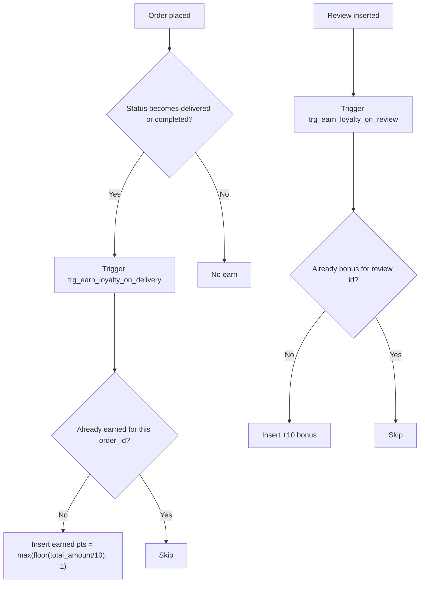
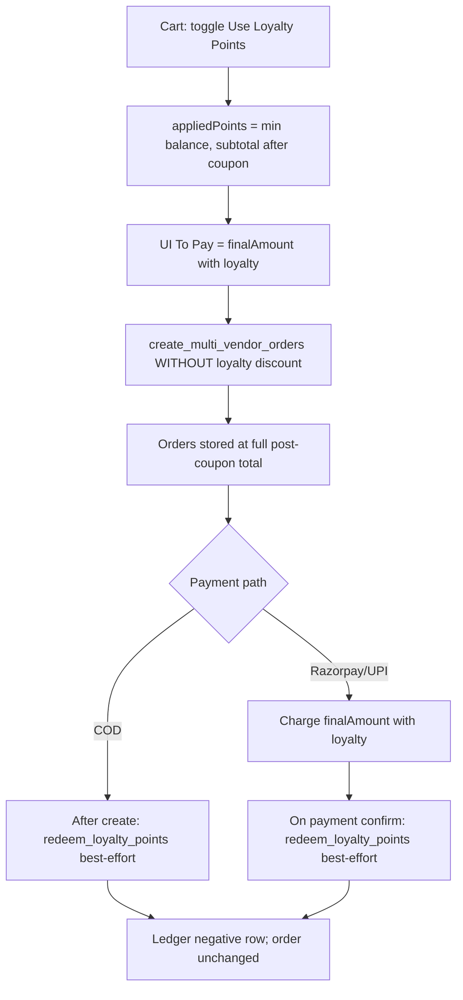
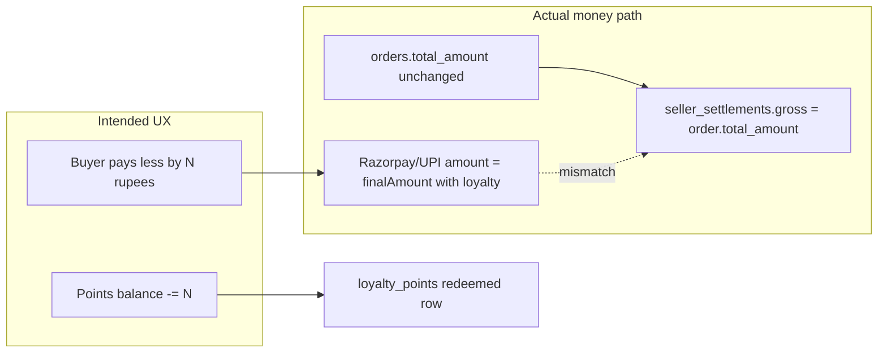
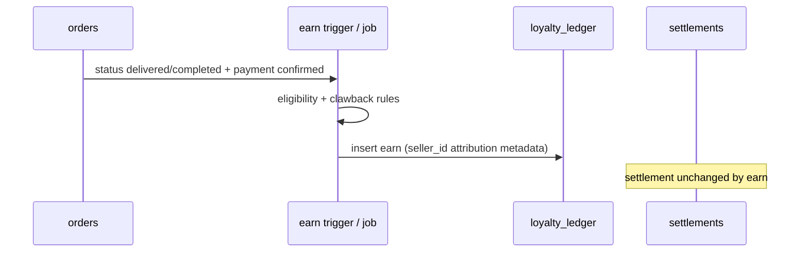

# Loyalty Points Feature — Complete Investigation Report

**Date:** 2026-08-07  
**Workspace:** `sociva-v1-main`  
**Live Supabase project:** `kkzkuyhgdvyecmxtmkpy`  
**Scope:** Investigation + recommendations only (no code changes)  
**Primary migration:** `supabase/migrations/20260411111431_590bd1b1-6f7e-432d-9189-6567b5c348f6.sql`

---

## Executive summary

Sociva has a **platform-wide, buyer-level loyalty ledger** that is partially live in production. Customers earn points when orders reach `delivered`/`completed` (1 point per ₹10 of `orders.total_amount`) and +10 on review insert. They can redeem at checkout at **1 point = ₹1**, with UI on Cart and Orders.

The program is **implicitly platform-funded**: there are no store-level settings, no seller UI, and no ledger allocating discount cost to sellers. Seller coupons (separate feature) *are* seller-funded and reduce `orders.total_amount` / settlements; loyalty does **not**.

**Critical finding:** redemption is **not wired into order money truth**. Checkout reduces the *client* “To Pay” / Razorpay session amount by loyalty points, but `create_multi_vendor_orders` only applies **coupon** discount. Loyalty is deducted from the points ledger *after* order creation as a best-effort RPC. Settlements use `orders.total_amount` (no loyalty field). This creates payment vs order vs settlement mismatches and an unaccounted platform liability.

Live DB (project `kkzkuyhgdvyecmxtmkpy`) confirms schema/triggers/RPCs are deployed. Usage is small today: **8 ledger rows**, **3 users**, **~107 points outstanding** (~₹107 liability at 1:1), **1 redemption** (−10 pts against an order still recorded at `total_amount = 30`).

**Verdict:** usable as a light MVP for demos, **not production-safe** for multi-store marketplace money flows. Fix money integrity (P0) before scaling earn rates or marketing the program.

---

## 1. Business model

### How the program works today

| Rule | Value | Evidence |
|------|--------|----------|
| Scope | Global per buyer (`user_id`), not per store | `loyalty_points.user_id`; no `seller_id` / `store_id` column (migration + live schema) |
| Earn (orders) | `FLOOR(total_amount / 10)`, minimum 1, on status → `delivered` or `completed` | `fn_earn_loyalty_on_delivery` |
| Earn (reviews) | +10 bonus on review insert | `fn_earn_loyalty_on_review` |
| Redeem rate | 1 point = ₹1 off cart (client UI) | `useLoyaltyRedeem.ts` comment; `redeem_loyalty_points` sets `_discount := _points` |
| Cap at checkout | Min(balance, amount after coupon) | `useCartPage.ts` `effectiveLoyaltyDiscount` |
| Expiration | Type `expired` exists in CHECK; **no job/logic expires points** | Migration CHECK only |
| Referral | Source `referral` in CHECK; **never awarded** | Migration CHECK only |
| Signup bonus | One-time backfill of 50 pts for buyers with prior orders; **no ongoing signup trigger** | Migration §7 INSERT |
| Seller controls | None | No seller UI / tables / settings |

Buyer-facing copy (`LoyaltyCard.tsx`):

> Earn 1 point per ₹10 spent · +10 bonus for reviews

At 1 pt = ₹1, that is effectively **~10% cashback** on delivered GMV — aggressive for a multi-vendor marketplace if liability is platform-borne.

### Who funds loyalty points?

**De facto: the platform (Sociva), unintentionally and incompletely.**

Evidence:

1. **No store funding model** — no `seller_id` on ledger, no seller settings for earn/redeem rates, no seller dashboard controls (grep of `src/**/seller/**` = zero loyalty hits).
2. **Coupons are the contrast** — seller coupons are per-`seller_id`, applied inside `create_multi_vendor_orders` to `coupon_discount` / `total_amount`, and thus reduce settlement gross. Loyalty is **not** a parameter to that RPC.
3. **Settlement math ignores loyalty** — `create_settlement_on_delivery_impl` sets `_gross := COALESCE(p_new.total_amount, 0)` (`20260801120000_ship_readiness_p0_money_truth.sql`). Since order totals never subtract loyalty, sellers are settled as if no loyalty discount occurred.
4. **Client reduces what the buyer pays** (`finalAmount` includes loyalty) for Razorpay/UPI session amount — so collected cash can be **less than** order/settlement gross → **platform shortfall**, not seller-funded discount.

There are **no code comments or docs** stating “platform absorbs loyalty” or “seller funds loyalty.” Liability is emergent from the implementation gap, not an explicit product decision.

### Liability / funding evidence table

| Actor | Pays when points earned? | Pays when points redeemed? | Documented? |
|-------|--------------------------|----------------------------|-------------|
| Platform | Creates unfunded liability (points = ₹) | Absorbs gap if buyer pays less than order total / settlement | **Implicit only** |
| Store owner | No | No (settlement not reduced) | N/A — no controls |
| Customer | Earns liability claim | Spends claim for discount | UI only |

---

## 2. Customer journey

### Earn



**When awarded**

- **Purchase completion / delivery:** after `orders.status` updates to `delivered` or `completed` (not at payment confirmation, not at place-order).
- **Review:** immediately on `INSERT` into `reviews`.
- **Not at:** cart add, payment success alone, or seller accept.

**Eligibility quirks**

- Earn uses full `orders.total_amount` (includes delivery fee when present; already net of coupon when coupon applied server-side).
- Cancelled / refunded orders: **no clawback** of earned points (no reverse ledger entries found).
- Duplicate protection: by `reference_id` + `source` (+ `type='earned'` for orders).

### Redeem



**UI**

- Cart (`CartPage.tsx`): switch when `balance > 0`; bill line “Loyalty Points”.
- Orders (`OrdersPage.tsx`): `LoyaltyCard` balance + history (buyer tab).

**Expiration / eligibility**

- No expiry date, TTL, or cron.
- No min redeem, no max % of order (beyond “cannot exceed amount after coupon”).
- No “cannot redeem on first order” / category exclusions.
- Multi-seller carts: loyalty **still allowed** (unlike coupons, which are blocked for multi-seller). Redemption references **first order id only**.

---

## 3. Store owner experience

| Capability | Status | Evidence |
|------------|--------|----------|
| Enable / disable loyalty for store | **Missing** | No settings / columns |
| Configure earn rate | **Missing** | Hardcoded in trigger `/ 10` |
| Configure redeem rate / caps | **Missing** | Hardcoded 1:1 in RPC + client |
| Loyalty campaigns | **Missing** | — |
| View points issued against their GMV | **Missing** | Ledger has no seller attribution |
| Absorb / opt out of platform redemptions | **Missing** | — |

**What sellers do have (related but separate):** `CouponManager.tsx` — seller-funded coupons with limits, dates, visibility. That is the only discount control sellers own.

**Seller-facing loyalty UI:** none. Loyalty appears only on buyer Orders / Cart.

---

## 4. Platform responsibilities

### What the platform currently does

| Responsibility | Implementation | Quality |
|----------------|----------------|---------|
| Calculation (earn) | DB trigger on `orders` | Working; rate hardcoded |
| Calculation (redeem ₹) | Client + RPC agree 1:1 | Working numerically; not atomic with order |
| Storage | `loyalty_points` append-only-style ledger | Working |
| Tracking / history | `get_loyalty_history` | Working for own user |
| Balance | `SUM(points)` via `get_loyalty_balance` | Working |
| Deduction | `redeem_loyalty_points` inserts negative row | Working but race-prone |
| Order discount application | **Not done** | Critical gap |
| Settlement / fee impact | **Not done** | Critical gap |
| Liability reporting | **Missing** | No admin views |
| Expiry / adjustments | Types exist; logic missing | Incomplete |
| Clawback on cancel/refund | **Missing** | Incomplete |

### Financial liabilities when redeemed



**Implications**

1. **Online pay:** platform may collect `order_total − N` while owing seller ~`order_total − platform_fee` → **platform funds the N rupees** (or books a loss / cash gap).
2. **COD:** UI shows lower “To Pay”; order/seller still see full `total_amount` → **operational confusion** and possible over/under collection at door.
3. **Multi-store:** one redemption tied to first order; discount may have applied to whole-cart `finalAmount` without proportional allocation across seller orders.
4. **Earn after redeem:** customer can earn points on the *undiscounted* order total even when they paid less — over-issuing points on top of the discount.

**Contrast with coupons:** coupon discount is server-validated and written into the order, so settlement gross already reflects seller promo cost.

---

## 5. Technical investigation

### End-to-end map

| Layer | Artifact | Role |
|-------|----------|------|
| DB table | `public.loyalty_points` | Ledger: `points` (+/−), `type`, `source`, `reference_id`, `description` |
| RLS | SELECT own rows only | No INSERT/UPDATE/DELETE for `authenticated` (writes via SECURITY DEFINER) |
| Triggers | `trg_earn_loyalty_on_delivery` on `orders` | Earn on delivery/complete |
| Triggers | `trg_earn_loyalty_on_review` on `reviews` | +10 bonus |
| RPCs | `get_loyalty_balance`, `get_loyalty_history`, `redeem_loyalty_points` | Read/redeem |
| Order create | `create_multi_vendor_orders` | **Coupon only** — no loyalty args |
| Settlements | `create_settlement_on_delivery_impl` | Gross = order total |
| Edge functions | None loyalty-specific | — |
| Frontend hooks | `useLoyalty.ts`, `useLoyaltyRedeem.ts` | Balance, history, apply/redeem |
| Frontend UI | `LoyaltyCard.tsx`, `CartPage.tsx`, `OrdersPage.tsx` | Display + redeem toggle |
| Types | `src/integrations/supabase/types.ts` | Table + RPCs generated |
| Account delete cleanup | `20260613074308_...sql` deletes `loyalty_points` for user | Present |

### Live schema verification (`kkzkuyhgdvyecmxtmkpy`)

Confirmed present and matching migration:

- Table columns: `id`, `user_id`, `points`, `type`, `source`, `reference_id`, `description`, `created_at`
- Functions: all five loyalty functions, SECURITY DEFINER
- Triggers: both earn triggers active
- RLS: single SELECT policy `"Users can view own loyalty points"`
- EXECUTE: granted to `PUBLIC` / `service_role` / `postgres` on loyalty RPCs

**Live usage snapshot (2026-08-07):**

| Metric | Value |
|--------|-------|
| Ledger rows | 8 |
| Distinct users | 3 |
| Issued (positive) | 117 |
| Redeemed (sum of negatives) | −10 |
| Outstanding liability (sum of positive balances) | 107 pts ≈ ₹107 |
| Breakdown | earned/order: 6 rows / 107 pts; bonus/review: 1 / 10; redeemed/redemption: 1 / −10 |

Sample redemption: order `76308f5e-…` had **−10 pts redeemed** while `orders.total_amount` remained **30.00** and `coupon_discount` **0** — direct evidence that redemption does not mutate order money fields.

### What works / partial / missing

See **Status matrix** below.

### API / UI flows

**Read path (working)**

1. Authenticated user → `get_loyalty_balance()` / `get_loyalty_history(_limit)`
2. React Query keys `loyalty-balance`, `loyalty-history`
3. `LoyaltyCard` on Orders (buyer)

**Redeem path (partial / unsafe)**

1. Toggle on Cart → local `appliedPoints`
2. `finalAmount` reduced for display + Razorpay session
3. Orders created **without** loyalty discount
4. `redeem_loyalty_points(_points, _order_id)` fired with `.catch(() => {})` — **non-blocking**
5. On RPC failure, toast says points “will be restored” (`useLoyaltyRedeem.ts`) but **no restore path exists** (and if RPC failed, points were never deducted — message is wrong; if payment already reflected discount, buyer got free discount)

### Security / integrity issues (document as critical)

1. **Money truth gap (P0)** — discount not on order; settlement/payment inconsistency.
2. **Best-effort redeem after pay (P0)** — can grant economic discount without ledger debit.
3. **Race on redeem (P0)** — balance check then insert without `FOR UPDATE` / advisory lock; concurrent redeems can overdraw.
4. **`get_loyalty_balance(_user_id)` (P1)** — SECURITY DEFINER allows optional `_user_id`; any authenticated caller can read another user’s balance if they know the UUID.
5. **No order ownership check in redeem (P1)** — `_order_id` not validated as belonging to `auth.uid()`; only used as `reference_id` text (fraud/abuse limited but audit-wrong).
6. **No clawback (P1)** — cancel/refund neither restores redeemed points nor reverses earned points.
7. **Earn rate economics (P1)** — ~10% cashback at 1:1 redeem is high for platform-funded liability.
8. **Schema stubs unused (P2)** — `expired`, `adjusted`, `referral`, ongoing `signup` bonus.

### Incomplete vs coupons (seller-funded baseline)

| Concern | Coupons | Loyalty |
|---------|---------|---------|
| Server-side apply on order | Yes | No |
| Settlement impact | Yes (lower total) | No |
| Seller ownership | Yes | No |
| Multi-seller cart | Blocked in UI | Allowed (awkward) |
| Idempotent redemption record | `coupon_redemptions` | Ledger row only; no order FK |

---

## 6. Recommendations

### Best loyalty model for Sociva (multi-store marketplace)

Compare options:

| Model | Who funds | Scalability | Fairness to sellers | Ease | Fit for Sociva |
|-------|-----------|-------------|---------------------|------|----------------|
| **A. Platform wallet (current intent, broken)** | Platform | Simple ledger | Sellers insulated if settlement correct | Easy UX | Good **if** platform promo budget + money truth fixed |
| **B. Per-store loyalty** | Each seller | N programs, complex UX | Fair — each store pays own rewards | Harder (settings, balances per store) | Good later for retention per brand |
| **C. Hybrid: platform points + seller boosters** | Platform base; sellers buy boosts | Medium | Clear cost attribution | Medium | **Recommended mid-term** |
| **D. Points as non-cash perks only** | Platform (non-₹) | High | Neutral | Easy | Weak vs current “= ₹ off” copy |

**Recommended near-term:** **Model A fixed** — keep **one global buyer balance** (matches current UX and society marketplace habit), **platform-funded**, with:

1. Explicit product rule: “Sociva Rewards funded by platform.”
2. Atomic checkout: reserve → apply discount on order(s) → capture payment → commit redemption (or rollback).
3. Settlement: either  
   - **(A1)** settle sellers on **pre-loyalty** merchandise total and book loyalty as `platform_subsidy` / reduced platform fee, or  
   - **(A2)** reduce buyer payment and reduce **platform fee / take rate** first; never silently underpay or overpay sellers relative to collected funds.
4. Conservative economics until accounting is solid: e.g. 1 pt per ₹50–100, redeem 1 pt = ₹1 with max 5–10% of order, expiry 6–12 months.

**Recommended mid-term:** evolve to **Model C** — optional seller “double points weekends” billed to seller wallet / reduced settlement, separate from base platform earn.

### Gaps → robust design

**Target architecture (earn)**



**Target architecture (redeem)**

```mermaid
sequenceDiagram
  participant C as Checkout
  participant R as redeem_and_checkout RPC
  participant L as loyalty_ledger
  participant O as orders
  participant P as Payment
  participant S as settlements
  C->>R: reserve points N
  R->>L: hold / pending redeem
  R->>O: create orders with loyalty_discount allocated
  R->>P: charge amount after loyalty
  alt success
    R->>L: commit redeemed
    O->>S: gross = merchandise rules; platform_subsidy = loyalty share
  else fail
    R->>L: release hold
    R->>O: cancel / no charge
  end
```

### Prioritized action items

#### P0 — Before any marketing / scale

1. **Stop silent money mismatch** — either disable redeem toggle in production until fixed, or implement atomic apply:
   - Extend `create_multi_vendor_orders` (or new RPC) with `_loyalty_points` validated server-side.
   - Persist `loyalty_discount` on orders (new column).
   - Include in `total_amount` / payment amount consistently.
2. **Settlement + payment reconciliation** — define and implement who pays N rupees; write `platform_subsidy` (or equivalent) so seller `net_amount` matches product policy.
3. **Make redeem transactional** — debit points in same transaction as order create (or reserve-before-pay); remove best-effort `.catch(() => {})`.
4. **Fix concurrency** — lock balance (`SELECT … FOR UPDATE` on a balances row or advisory lock per user) inside redeem.
5. **Correct failure UX** — remove false “will be restored” toast; surface real success/failure and block navigation if debit failed after discount was promised.

#### P1 — Production hardening

6. Decide and document **funding model** (platform vs hybrid) in product + finance.
7. **Tune earn/redeem economics** (lower cashback; caps; min order).
8. **Clawbacks** — on cancel/refund: reverse unearned / restore redeemed as policy requires.
9. **Validate `_order_id` ownership** on redeem; restrict `get_loyalty_balance` to self (drop free `_user_id` or admin-only).
10. **Multi-seller allocation** — proportional loyalty discount across seller groups or disallow like coupons.
11. **Admin liability dashboard** — outstanding points, issuance, redemptions, subsidy cost.
12. Earn only when **payment confirmed** (or COD completed), not merely status string — align with money truth migration philosophy.

#### P2 — Growth features

13. Expiry job writing `type='expired'`.
14. Ongoing signup / referral bonuses (sources already in CHECK).
15. Seller boosters / campaigns (Model C).
16. Dedicated Rewards page (terms, rates, FAQ).
17. Notifications when points earned/expiring.
18. Idempotency keys on redeem tied to checkout `idempotency_key`.

### Clear improvements before development

- **Product decision memo (1 page):** funding owner, earn rate, redeem rate, caps, expiry, cancel policy, multi-seller behavior.
- **Money flow diagram signed off** by whoever owns settlements / Razorpay Route.
- **Feature flag** `loyalty_redeem_enabled` default off until P0 tests pass.
- **Test plan:** COD + Razorpay + multi-seller + concurrent redeem + cancel-after-redeem + delivery earn idempotency.
- **Do not** raise earn rates or advertise “10% back” until liability is accounted.

---

## Status matrix

| Area | Status | Notes |
|------|--------|-------|
| Ledger table + RLS SELECT | **Working** | Live |
| Earn on delivery/complete | **Working** | Trigger live; ~10% rate aggressive |
| Earn on review | **Working** | +10 |
| Balance / history RPCs + UI | **Working** | Orders `LoyaltyCard`, Cart toggle |
| Redeem RPC (ledger debit) | **Partial** | Works numerically; races; no order link integrity |
| Apply discount to order total | **Missing** | Critical |
| Apply discount to settlements | **Missing** | Critical |
| Atomic checkout + redeem | **Missing** | Best-effort post-hoc |
| Seller controls / UI | **Missing** | — |
| Platform admin / liability | **Missing** | — |
| Expiration | **Missing** | Type only |
| Referral / ongoing signup | **Missing** | CHECK / one-time backfill only |
| Cancel/refund clawback | **Missing** | — |
| Edge functions | **N/A / Missing** | Not required if RPCs solid |
| Docs / product funding statement | **Missing** | This report is first thorough write-up |
| Live usage | **Working (tiny)** | 107 pts outstanding |

---

## Recommended model comparison (summary)

| | Keep global platform rewards (fixed A) | Per-store only (B) | Hybrid (C) |
|--|----------------------------------------|--------------------|------------|
| Matches current UI | Yes | No | Extends A |
| Seller fairness | Via subsidy accounting | Natural | Explicit boosts |
| Implementation cost now | Medium (fix money path) | High | Medium→High |
| **Choose for next build** | **Yes (P0/P1)** | Later if brands demand | After A stable |

---

## Evidence index (key files)

| File | Relevance |
|------|-----------|
| `supabase/migrations/20260411111431_590bd1b1-6f7e-432d-9189-6567b5c348f6.sql` | Full loyalty schema, triggers, RPCs, backfills |
| `supabase/migrations/20260801120000_ship_readiness_p0_money_truth.sql` | Settlement gross = order total |
| `supabase/migrations/20260803180000_ship_seller_silent_failure_fixes.sql` | `create_multi_vendor_orders` coupon-only discount |
| `supabase/migrations/20260613074308_930a912a-3701-4f43-bdaa-ed4c1e9abc15.sql` | Deletes loyalty on account wipe |
| `src/hooks/queries/useLoyalty.ts` | Balance/history queries |
| `src/hooks/useLoyaltyRedeem.ts` | Apply/redeem; misleading restore toast |
| `src/hooks/useCartPage.ts` | `finalAmount`, best-effort redeem, no RPC loyalty param |
| `src/pages/CartPage.tsx` | Redeem UI |
| `src/pages/OrdersPage.tsx` | `LoyaltyCard` placement |
| `src/components/loyalty/LoyaltyCard.tsx` | Rates copy + history |
| `src/components/seller/CouponManager.tsx` | Seller-funded alternative (no loyalty) |
| `src/integrations/supabase/types.ts` | Generated table/RPC types |

---

## Appendix: critical bugs to track (not fixed in this investigation)

Per brief: investigation only; listed for triage.

1. Loyalty discount omitted from `create_multi_vendor_orders` / order totals while payment UI uses discounted amount.  
2. Settlements ignore loyalty → seller payout vs collection mismatch under platform-funded redeem.  
3. Non-blocking redeem after order/payment success.  
4. Misleading “points will be restored” error copy.  
5. Redeem race / possible negative effective balance under concurrency.  
6. `get_loyalty_balance(_user_id)` cross-user read via SECURITY DEFINER.

---

---

## Update (2026-08-07) — Phase 1 platform-funded shipped

Product decision confirmed: **platform-funded** global rewards. Implementation status and QA: see [`loyalty-phase1-platform-funded.md`](./loyalty-phase1-platform-funded.md).

P0 money-truth gaps addressed: order `loyalty_discount_amount`, reserve→commit checkout, settlement `platform_loyalty_subsidy`, cancel/refund clawbacks, migrated balances.

*End of report.*
