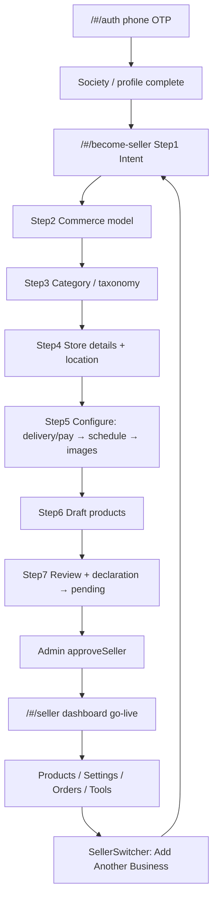

# Sociva Seller E2E Test Plan — Production Readiness Audit

**Status:** Plan approved · Phase 1 done · Phase 2 matrix + S1 ops smoke done (see `docs/seller-e2e-phase2-results.md`) · exhaustive/Android open  
**Auth (iOS / Apple Review bypass):** phone `0123456789` · OTP `1234` · country `+91`  
**Router:** HashRouter → all paths are `/#/...`  
**App under test:** `https://www.sociva.in` (web) first for plan dry-runs; Android emulator after Phase 1 gate  
**Supabase project:** `kkzkuyhgdvyecmxtmkpy` (Sociva)  
**Constraint:** One store per `(user_id, primary_group)` — four stores require **four different parent groups**

---

## 0. Credentials & execution rules

| Item | Value |
|------|--------|
| Test phone | `0123456789` |
| OTP | `1234` |
| Send OTP edge | `msg91-send-otp` → returns `apple-review-bypass` when phone + CC `91` |
| Verify OTP edge | accepts OTP `1234` for that bypass |
| Login route | `/#/auth` |
| Become seller | `/#/become-seller` |
| Seller hub | `/#/seller` |
| Evidence | Screenshot / DB row / toast copy / URL after every pass/fail |
| No shortcuts | Do not seed stores via SQL/API except admin **approve** when UI has no seller-facing approve |
| Fail rule | Any silent toast-success with no DB write = **FAIL** |

---

## 1. End-to-end seller journey map (before any test run)

### Onboarding steps (code truth — 7 steps)

| # | Step | UI focus | Persist |
|---|------|----------|---------|
| 1 | Intent | “What are you selling?” | `sessionStorage` intent phrase / seed name |
| 2 | Buyers / commerce | Cart · Book · Enquire · Contact (+ soft tags rental/appointment/digital) | maps → `onboarding_store_action_type` |
| 3 | Category | Taxonomy suggest / browse / request category | `primary_group` + categories |
| 4 | Store | Name*, desc, hours, beyond-community, license, location | `seller_profiles` draft |
| 5 | Configure | Delivery/payments → schedule → images | may require bookable availability |
| 6 | Products | `DraftProductManager` ≥1 product | products `approval_status=draft` |
| 7 | Review | Declaration → submit | profile `pending`; products `pending` |

### Post-approval modules

| Area | Route / surface | CRUD notes |
|------|-----------------|------------|
| Dashboard | `/#/seller` tabs: orders, support, refunds, schedule*, tools, stats | *schedule if bookable |
| Products | `/#/seller/products`, `/new`, `/:id/edit` | Hard DELETE; toggle `is_available` only if approved |
| Settings | `/#/seller/settings` | store-info, photos, location, hours, payments, delivery, festivals, payouts + pause |
| Coupons | Dashboard → tools | Create/read/update/delete |
| Category requests | `/#/seller/category-requests` | Request new category |
| Earnings / payouts | `/#/seller/earnings`, `/#/seller/payouts` | Read-heavy |
| Messages | `/#/seller/messages` | Auth shell only (no SellerRoute) |
| Multi-store | SellerSwitcher → Add Business | New group only |

### Soft delete / restore (platform reality)

| Entity | Soft delete? | Restore? | Test implication |
|--------|--------------|----------|------------------|
| Products | **No** — hard delete | N/A | TC: delete is irreversible; availability toggle is the “hide” path |
| Stores | **No** soft delete | Pause/Resume via `is_available` | Treat pause as operational off; no restore-from-deleted |
| Drafts | Draft profiles/products | Resume onboarding draft | Test Save & Exit + reload |

---

## 2. Four stores under one seller (matrix)

Fourth model chosen: **Rental** (soft tag `rental` → commerce `enquire`, kind `rental`). Best flexibility check: soft-tag remapping, date-range buyer UI, non-cart enquiry orders, distinct group.

| # | Store codename | Commerce | Soft tag | Target `primary_group` | Seed intent phrase | Example listing |
|---|----------------|----------|----------|------------------------|--------------------|-----------------|
| S1 | Cart Kitchen | `cart` → `add_to_cart` | — | `food_beverages` | Home-cooked tiffin | Veg thali ₹120, stock 20 |
| S2 | Bookable Studio | `book` → `book` | — | `education_learning` | Yoga classes | 60-min Hatha slot |
| S3 | Contact Pro | `contact` → `contact_seller` | — | `professional` | Tax filing help | GST consult (no price req) |
| S4 | Rental Hub | `enquire` (via rental tag) | `rental` | `rentals` | Generator rental | Generator / day |

**Fallback groups** if conflict/UI suggests differently: `classes` (book), `services`/`home_services` (enquire), `resale` (cart), `property` (contact). Never reuse same `primary_group`.

**Approval gate:** After each submit (or batch), admin must approve before go-live / approved-product toggles. Document whether one admin session can approve all four.

---

## 3. Phase gates

| Gate | Criteria to proceed |
|------|---------------------|
| **G0 Plan** | This document reviewed; four-store matrix agreed |
| **G1 Phase 1** | Onboarding for **S1** complete end-to-end with evidence; UX issues logged; production-quality bar met or waivers signed |
| **G2 Android** | Same auth + onboarding smoke on emulator after G1 |
| **G3 Phase 2** | All four stores + module CRUD matrix green or defects filed with severity |

---

# Phase 1 — Seller onboarding (S1 first; then S2–S4 onboarding deltas)

Execute as a **new seller would**. Prefer clean account state; if Apple user already has profiles, document and use Add Another Business / unused groups.

## P1-A Auth & entry

| ID | Case | Steps | Expected |
|----|------|-------|----------|
| P1-A01 | Phone validation | Enter `<10` digits | Block send / clear error |
| P1-A02 | Age gate | Try send without age checkbox | Blocked |
| P1-A03 | Send OTP | `0123456789` + age | Advances to OTP; bypass reqId |
| P1-A04 | Wrong OTP | `0000` | Error; stay on OTP |
| P1-A05 | Correct OTP | `1234` | Session created; society or home |
| P1-A06 | Society required | If no society | Must complete search/map/request |
| P1-A07 | Become Seller CTA | Profile / QuickActions | Lands `/#/become-seller` step 1 |
| P1-A08 | Deep link | Open `/#/become-seller` logged out | Redirect `/#/auth` then resume or land step 1 after login |
| P1-A09 | Persistence | Reload mid-OTP | Sensible recover / re-send |

## P1-B Step 1 Intent

| ID | Case | Expected |
|----|------|----------|
| P1-B01 | Empty continue | Blocked or soft warn |
| P1-B02 | Chip “Home-cooked tiffin” | Phrase filled; suggestions later |
| P1-B03 | Free text “T-shirts” | Maps toward clothing/resale aliases |
| P1-B04 | Back from step 2 | Intent retained |
| P1-B05 | UX clarity | No jargon; one primary CTA; brand-consistent |

## P1-C Step 2 Commerce + soft tags

| ID | Case | Expected |
|----|------|----------|
| P1-C01 | Select Cart | `add_to_cart` path |
| P1-C02 | Select Book | `book` + availability later required |
| P1-C03 | Select Enquire | `request_service` |
| P1-C04 | Select Contact | `contact_seller` |
| P1-C05 | Soft tag Rental | Forces enquire commerce / rental kind |
| P1-C06 | Soft tag Appointment | Forces book |
| P1-C07 | Soft tag Digital | Forces enquire (note: Terms say no digital goods — **flag UX vs policy**) |
| P1-C08 | Change model after category | Conflict / reset draft products confirm if needed |

## P1-D Step 3 Category

| ID | Case | Expected |
|----|------|----------|
| P1-D01 | Auto-suggest from intent | Relevant group/category |
| P1-D02 | Browse override | Can pick different valid group |
| P1-D03 | Request category | Dialog submits request; no crash |
| P1-D04 | Group conflict | Existing non-draft same `primary_group` → clear block message |
| P1-D05 | License group `health` | License UI mandatory before continue |
| P1-D06 | Multi-select categories | ≥1 required later |

## P1-E Step 4 Store

| ID | Case | Expected |
|----|------|----------|
| P1-E01 | Empty business name | Continue disabled / error |
| P1-E02 | Valid name + desc | Draft saveable |
| P1-E03 | Hours | At least one day later enforced |
| P1-E04 | Location picker | Coords or society lat/lng |
| P1-E05 | Beyond community toggle | Persists |
| P1-E06 | Save draft | `verification_status=draft` in DB |
| P1-E07 | Save & Exit | `/#/profile`; resume restores step |
| P1-E08 | Reload mid-step | `localStorage` step + draft products restore |
| P1-E09 | License missing on mandatory | Continue blocked |

## P1-F Step 5 Configure

| ID | Case | Expected |
|----|------|----------|
| P1-F01 | Delivery options cart store | Sensible defaults; save |
| P1-F02 | UPI on without UPI ID | Block continue/submit |
| P1-F03 | COD / online toggles | Persist |
| P1-F04 | Schedule bookable | Must set active `service_availability_schedules` before products |
| P1-F05 | Zero operating days | Block |
| P1-F06 | Images upload | Accept common formats; fail clearly on bad file |
| P1-F07 | Skip images | Allowed or explicit optional copy |

## P1-G Step 6 Products (draft)

| ID | Case | Expected |
|----|------|----------|
| P1-G01 | Zero products continue | Blocked |
| P1-G02 | Create draft product | Row `approval_status=draft` |
| P1-G03 | Cart: price required | Empty price blocked |
| P1-G04 | Contact: price optional | Can save without price if model allows |
| P1-G05 | Book: duration / slot fields | Present when bookable |
| P1-G06 | Edit draft | Updates |
| P1-G07 | Delete draft | Hard remove; gone from list+DB |
| P1-G08 | Action type selector | Only allowed types for category |
| P1-G09 | Stock / prep time cart | Persist |
| P1-G10 | Image on product | Upload + preview |

## P1-H Step 7 Review & submit

| ID | Case | Expected |
|----|------|----------|
| P1-H01 | Summary accuracy | Name, group, products, model match |
| P1-H02 | Declaration unchecked | Submit blocked |
| P1-H03 | Submit success | Profile `pending`; products `pending`; toast; completion UI |
| P1-H04 | Admin notified | Side-effect (if observable) |
| P1-H05 | Seller cannot self-approve | Direct DB/API attempt fails (guard trigger) |
| P1-H06 | Pending UI | Cannot go-live; dashboard access rules documented |
| P1-H07 | Double submit | Idempotent / no duplicate stores |

## P1-I Onboarding UX audit (evidence required)

For each finding: screenshot, step #, severity (blocker/major/minor), recommendation.

Checklist:

- Ambiguous labels / missing helper text  
- Dead ends / back-stack loss  
- Validation only on submit vs inline  
- Mobile keyboard covering CTAs  
- Progress indicator accuracy (7 steps)  
- Soft-tag “digital” vs legal Terms conflict  
- Duplicate parent groups in picker (`food` vs `food_beverages`, `personal` vs `personal_care`) — confusion risk  
- Friction: license, location, UPI order of asks  

**Phase 1 exit:** S1 submitted + UX findings filed. Prefer admin approve S1 before Phase 2 ops on S1; S2–S4 onboarding can run after G1 if multi-store entry works while pending (verify `hasSellerProfile` / Add Business).

---

# Phase 2 — Store operations (exhaustive)

Run per store where applicable. Prefix IDs: `S1-` … `S4-`.

## P2-0 Multi-store & switcher

| ID | Case | Expected |
|----|------|----------|
| P2-0-01 | Add Business | Opens onboarding for new group |
| P2-0-02 | Same group again | Conflict error |
| P2-0-03 | Four distinct groups | Four `seller_profiles` for user |
| P2-0-04 | Switcher | `currentSellerId` changes; products/orders scoped |
| P2-0-05 | Settings after switch | Edits hit correct store |
| P2-0-06 | Public storefront | `/#/seller/:id` shows correct store |

## P2-1 Products CRUD (all stores)

| ID | Op | Cases |
|----|----|-------|
| P2-1-C | Create | Min fields; max fields; image; action_type; stock 0; stock large; special chars in name; duplicate name allowed? |
| P2-1-R | Read | List filters; empty state; after switcher; deep link edit |
| P2-1-U | Update | Price; name; stock; action_type change; content change on approved → `pending`; rejection_note clear |
| P2-1-D | Delete | Hard delete; confirm UI; order-history orphan behavior; cannot delete others’ product |
| P2-1-Rest | Restore | **N/A** — document; availability as surrogate |
| P2-1-V | Validation | Neg price; empty name; book without schedule; contact without phone if required |
| P2-1-E | Errors | Offline save; storage fail; RLS deny |
| P2-1-Nav | Navigation | List → new → back; edit → cancel dirty |
| P2-1-Persist | Persistence | Reload after edit; draft vs pending |
| P2-1-Authz | Permissions | Buyer cannot mutate; seller A cannot edit seller B |
| P2-1-UI | Consistency | Currency; veg badge; availability switch disabled when not approved |
| P2-1-Integrity | Data | DB columns match UI; no double rows |
| P2-1-Reg | Regression | Cart product still carts after edit; book product still books |

### S1 cart-specific

Stock decrement on order (RPC only — no double decrement); cancel restocks; low-stock badge; prep time; delivery flags.

### S2 bookable-specific

Schedule tab visible; slots CRUD; hours; booking rules; cannot proceed without availability; conflict double-book.

### S3 contact-specific

CTA opens contact/chat; `creates_order=false` path; no forced price; phone/WhatsApp fields.

### S4 rental-specific

Date-range fields on listing/buyer sheet; soft tag effects; enquire order type; period labels from `system_settings`.

## P2-2 Settings tabs CRUD

For each tab (`store-info`, `photos`, `location`, `hours`, `payments`, `delivery`, `festivals`, `payouts`):

| Dimension | Cases |
|-----------|-------|
| Create/Update | Save valid payload; toast + DB |
| Read | Reload shows saved |
| Validation | UPI format; empty required |
| Error | Failed update surfaces error (no false success) |
| Pause/Resume | Only when `approved`; UPI gate when online pay on |
| License | Upload; pending; seller cannot self-approve |

## P2-3 Coupons (Tools)

| ID | Case |
|----|------|
| P2-3-C01 | Create % and flat |
| P2-3-R01 | List scoped to current store |
| P2-3-U01 | Edit window / min order |
| P2-3-D01 | Delete / deactivate |
| P2-3-V01 | Expiry past; 0%; >100% |
| P2-3-E01 | Apply at checkout (buyer regression) |

## P2-4 Orders / refunds / support

| ID | Case |
|----|------|
| P2-4-01 | Accept / reject / prepare / ready / complete (cart) |
| P2-4-02 | Booking accept / complete |
| P2-4-03 | Enquiry respond |
| P2-4-04 | Cancel → stock restore (cart) |
| P2-4-05 | Refund request seller actions; terminal state not forgeable |
| P2-4-06 | Support ticket reply |
| P2-4-07 | Filters / empty / urgent toast |
| P2-4-08 | Payment status not client-writable to paid |

## P2-5 Earnings, payouts, analytics, messages

| ID | Case |
|----|------|
| P2-5-01 | Earnings numbers match completed orders |
| P2-5-02 | Payouts UI empty/error states |
| P2-5-03 | Stats / low stock / reliability widgets |
| P2-5-04 | Messages thread send/receive |

## P2-6 Category requests

| ID | Case |
|----|------|
| P2-6-01 | Create request |
| P2-6-02 | Read list status |
| P2-6-03 | Duplicate request behavior |

## P2-7 Navigation, state, permissions, UI, integrity, regression

| ID | Theme | Cases |
|----|-------|-------|
| P2-7-N | Navigation | All seller routes; back; deep links; HashRouter |
| P2-7-S | State | Refresh; kill app (Android); switcher; draft keys |
| P2-7-P | Permissions | SellerRoute; self-approve blocks; product approve blocks; RLS |
| P2-7-U | UI | Dark theme; safe-area; loading/error/empty consistency |
| P2-7-I | Integrity | Cross-check UI vs SQL after each mutation |
| P2-7-R | Regression | Buyer cart multi-store guard; checkout; landing download unrelated smoke |

## P2-8 Android emulator suite (after G1)

| ID | Case |
|----|------|
| P2-8-01 | Install / open Capacitor build or APK |
| P2-8-02 | Login bypass OTP |
| P2-8-03 | Onboarding smoke S1 |
| P2-8-04 | Keyboard / safe-area CTAs |
| P2-8-05 | Image picker native |
| P2-8-06 | Status bar / dark theme |
| P2-8-07 | Background resume session |

---

## 4. Execution order (when authorized)

1. Login Apple phone → confirm society  
2. **Phase 1** full onboarding **S1** + UX audit → **Gate G1**  
3. Admin approve S1  
4. S1 Phase 2 product/settings smoke  
5. Onboard **S2, S3, S4** (deltas only + full submit) → approve  
6. Exhaustive Phase 2 matrix per store  
7. Android pass (P2-8)  
8. Defect triage → retest → production readiness sign-off  

---

## 5. Defect log template

| Field | Content |
|-------|---------|
| ID | DEF-### |
| Phase / TC | e.g. P1-E04 |
| Severity | Blocker / Major / Minor / UX |
| Evidence | screenshot path / SQL / video |
| Expected vs actual | |
| Recommendation | |
| Status | Open / Fixed / Waived |

---

## 6. Sign-off

| Role | Name | Date | Result |
|------|------|------|--------|
| Executor (agent) | | | |
| Product owner | | | |
| Phase 1 gate | | | Pass / Fail |
| Phase 2 gate | | | Pass / Fail |
| Android gate | | | Pass / Fail |

---

*Generated from code evidence: `BecomeSellerPage`, `useSellerApplication`, `listing-intent.ts`, `buyer-journey.ts`, `SellerRoute`, seller settings/products hooks, MSG91 Apple bypass, parent_groups live in `kkzkuyhgdvyecmxtmkpy`.*
