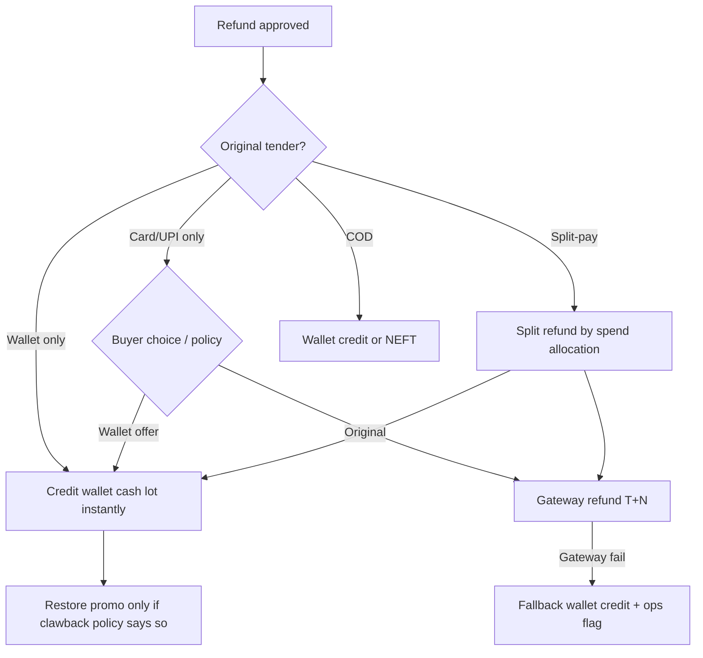
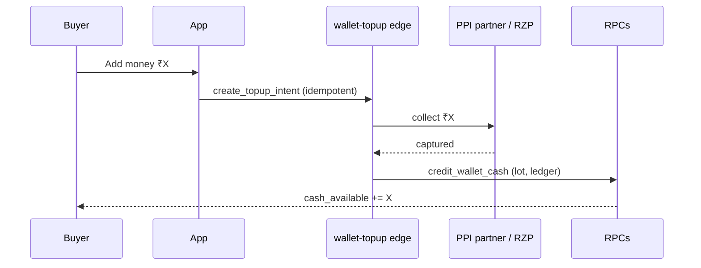
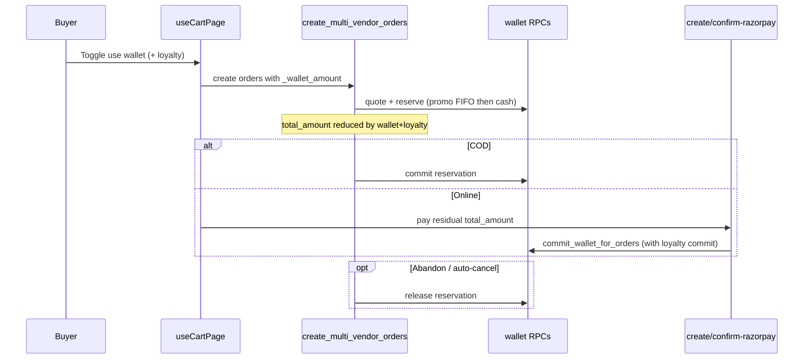
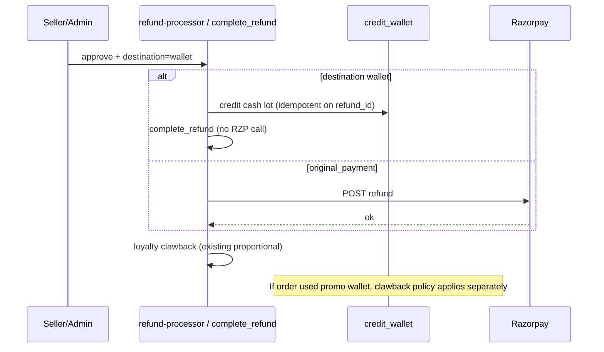
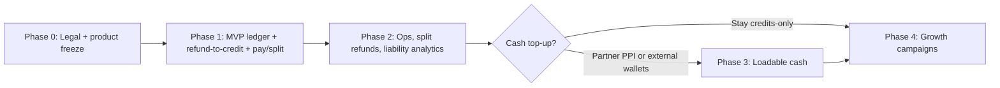

# Sociva Digital Wallet — Architecture Study & Proposal

**Date:** 2026-08-07  
**Scope:** Research + enterprise architecture proposal.  
**Implementation:** Phase 1 MVP shipped in-repo — see [`wallet-mvp-implementation.md`](./wallet-mvp-implementation.md).  
**Companion canvas:** Cursor Canvas `wallet-architecture-study.canvas.tsx`  
**Grounding:** Existing Razorpay / loyalty / refund / settlement systems in this repo.

---

## Executive recommendation (opinionated)

| Decision | Choice |
|----------|--------|
| **MVP product** | **Store credit + promo credit wallet** — refunds and promotions as INR balances. **No buyer cash top-up** in MVP. |
| **Ledger** | **Append-only double-entry ledger** + cached wallet balances + **FIFO credit lots** (cash vs promo buckets). Mirror loyalty’s reserve → commit → release pattern. |
| **Loyalty relationship** | Keep **loyalty points** separate (`loyalty_wallets` / `loyalty_ledger`). Wallet is **INR liability**; loyalty remains platform-funded points (1 pt ≈ ₹1 discount). |
| **Refund default** | Prefer **original payment method** (current behavior). Offer **instant wallet credit** as an explicit buyer choice for eligible prepaid refunds. |
| **Cash top-up** | **Phase 3+ only**, via a **licensed PPI issuer / bank partner** (Swiggy–ICICI pattern). Do **not** self-issue a loadable marketplace PPI without counsel + authorization. |
| **Regulatory posture** | Treat **RBI Draft PPI Directions (Apr 2026)** as a hard product constraint: marketplace-issued loadable INR wallets are likely regulated; reward/points-style balances are clearer carve-outs. **Legal review required before any top-up.** |

---

## Part 1 — Industry research

### 1.1 Method & evidence quality

| Claim type | How marked below |
|------------|------------------|
| **Observed product** | Documented in public help/T&Cs, press, or widely reported UX |
| **Inferred architecture** | Reasonable engineering inference; not confirmed by vendor docs |
| **Regulatory** | Cite RBI / legal commentary; draft vs final noted |

Apps studied: **Swiggy, Zomato, Uber Eats (Uber Cash), Blinkit / Zepto (via Amazon Pay Balance & marketplace patterns), Amazon Pay, PhonePe**.

---

### 1.2 Customer lifecycle (cross-product patterns)

#### A. Adding money (top-up)

| App / product | Observable behavior | Notes |
|---------------|---------------------|-------|
| **Swiggy Money** | Top-up via UPI / card / netbanking; powered by **ICICI Bank insta wallet** (press + T&Cs) | **Bank-issued PPI**, not a pure closed Swiggy ledger. KYC via bank for non-ICICI users. |
| **Zomato Money** | Manual + **Auto-add** when balance below threshold; tied to one payment method (T&Cs) | Auto-add retries (reported max 5); cannot update method without cancel/re-enable. |
| **Uber Cash / Uber Money** | Purchase credits; region-specific T&Cs | Purchased vs promo treated differently for refundability. |
| **Amazon Pay Wallet** | Load via card/NB/UPI (and constrained cash channels); Auto Reload | Explicit PPI framing; KYC tiers; cannot withdraw to bank in general T&Cs. |
| **PhonePe** | Full-KYC PPI / UPI super-app wallet | Interoperable P2P/P2M; not marketplace-closed. |
| **Blinkit / Zepto** | Often accept **Amazon Pay Balance** as a payment instrument | Many q-commerce apps lean on **third-party wallet / gift-card rails** rather than issuing their own PPI. |

**Pattern:** Leading food/marketplaces that allow true “add money” almost always sit on a **licensed issuer** (bank/NBFC/PPI license) or accept **external wallets**. Self-issued cash load is the regulated path.

#### B. Paying with wallet

- Wallet appears as a first-class payment method at checkout.
- If balance ≥ payable → single-instrument pay (often “one-tap”).
- If balance < payable → **split-pay**: wallet debit + secondary instrument for remainder (**Swiggy Money** publicly marketed this; **Uber Cash** auto-applies then charges preferred method for shortfall).

#### C. Combining wallet + other methods

| Pattern | Typical rule |
|---------|----------------|
| Wallet first | Debit wallet up to payable; residual via UPI/card |
| Promo vs cash priority | **Promo/expiring first** (Uber Cash: earliest expiry applied automatically) |
| Coupons + wallet | Coupons reduce payable; wallet applies to net payable |
| Loyalty + wallet | Points/loyalty usually applied as **discount before** payment instruments |

#### D. Refunds

| Scenario | Common product behavior |
|----------|-------------------------|
| Paid with wallet | Refund **back to wallet** (instant) — Swiggy Money T&Cs for cancellations paid via wallet |
| Paid with UPI/card | Default **original method** (3–7 banking days); some apps offer **credits** for speed or gateway failure |
| COD / POD | Often **wallet credit** or NEFT to bank (Amazon POD → bank or Amazon Pay Balance) |
| Partial refund | Pro-rata to instruments used; if split-pay, refund wallet portion to wallet and card portion to card (**inferred** best practice) |
| Failed gateway refund | Escalate to **wallet credit** as remediation (user reports on Zomato) |

**Sociva today:** `refund_method` defaults to `original_payment`; `refund-processor` calls Razorpay refund; no store-credit path (`docs/loyalty-phase1…`, refund migrations).

#### E. Promotional credits, cashback, referrals

Industry separates **monetary character**:

| Bucket | Source | Expiry | Withdrawal | Clawback |
|--------|--------|--------|------------|----------|
| **Cash / purchased** | Top-up, refund of real money | Often none or long (Zomato Money: up to ~4 years from add in auto-add T&Cs) | Usually **no** P2B cash-out on closed wallets | Rare; chargebacks reverse |
| **Promo / reward** | Cashback, referral, support goodwill | Days–months; campaign-specific | Never | Cancel/return often clawed; Amazon cashback sometimes **kept** with refund reduced |
| **Gift / voucher codes** | Corporate vouchers | Code expiry before load; post-load rules vary (Swiggy: code 6–12 months; loaded gift may have 365-day validity per partner T&Cs) | No | Per campaign |

**Amazon Pay cashback (observed):** Cashback lands as **gift-card balance** in Amazon Pay Balance; non-cashable; on cancel after credit, cashback may **remain** and refund to original method is **net of cashback**.

**Sociva today:** Loyalty earn ≈ `FLOOR(total_amount/10)` on delivery + review bonus; coupons via `coupons` / `coupon_redemptions`. No separate cashback table.

#### F. Expiry rules (summary)

1. **Purchased / refund cash** → prefer **no expiry** (trust); if expiry required by partner PPI, surface clearly.
2. **Promo** → always `expires_at`; spend **FIFO by expiry**.
3. **Support credits** → often no expiry (Uber support credits) or policy-defined.
4. **Voucher codes** → expire before redemption; post-load follows wallet bucket rules.

#### G. History & statements

Leading apps show: date, type (top-up / pay / refund / cashback / expiry), order link, running or per-entry amount, instrument. Enterprise expectation: exportable statement, idempotent reference IDs, support-visible ledger.

---

### 1.3 Refund handling (deep dive)



**Failed / cancelled orders**

| Payment state | Wallet effect |
|---------------|---------------|
| Wallet reserved, payment never confirmed | **Release** hold (same as loyalty unpaid cancel) |
| Wallet committed, order cancelled pre-fulfillment | **Refund** wallet spend to same buckets (cash→cash, promo→promo with original expiry if possible) |
| Partial cancel / item refund | Pro-rata wallet + gateway |

**Promo clawbacks**

- Referral bonus for fraud: reverse promo lot.
- Cashback on cancelled order: either reverse promo or reduce gateway refund (Amazon-style). **Recommend for Sociva:** reverse unspent promo cashback; if already spent, create negative adjustment against available promo then cash (documented policy).

---

### 1.4 Security, double-spend, reconciliation, ledgers

#### Security & fraud (industry norms)

- KYC tiers for loadable PPIs; velocity limits on top-up and spend.
- Device / session binding for one-tap wallet pay.
- Separate **authorization** (hold) from **capture** (commit).
- Admin credits require dual-control above thresholds (**inferred** enterprise practice).
- Immutable audit log; no silent balance UPDATE without ledger row.

#### Double-spending protection

1. **Reserve** balance in a single DB transaction (`SELECT … FOR UPDATE` on wallet row).
2. Idempotency keys on every mutation (Sociva already uses this on `payment_ledger`).
3. Checkout holds expire (TTL) like `loyalty_reservations`.
4. Never trust client-reported balance or amount.

#### Reconciliation & accounting

| Book | Purpose |
|------|---------|
| Customer liability | Sum of cash + promo outstanding |
| Gateway clearing | Razorpay captures / refunds |
| Seller payable | `seller_settlements` |
| Platform promo expense | Promo credits issued |
| Platform cash liability | Refund-to-wallet + (future) top-ups held |

Daily: `Σ wallet balances` = `Σ ledger credits − debits` per account; variance alerts.

#### Ledger models

| Model | Pros | Cons |
|-------|------|------|
| Single balance column | Simple | Weak audit; race-prone |
| Event log only | Auditable | Hard queries; easy to drift cache |
| **Double-entry + cache** (recommended) | Accounting-grade; reconciles | More schema |
| Third-party ledger SaaS | Compliance offload | Cost; India PPI still needs issuer |

**Recommendation:** Double-entry entries (`debit_account`, `credit_account`, `amount`) with **denormalized** `buyer_wallets` balances updated in the same transaction — same spirit as `loyalty_wallets` + `loyalty_ledger`.

---

### 1.5 Regulatory notes (India PPI) — critical for Sociva

**Source quality:** Legal commentary on **RBI Draft Master Directions on PPIs (22 Apr 2026)** and related analyses (Spice Route Legal, Khaitan, Mondaq, Ikigai). **Draft, not final** as of study date — counsel must re-check before build of top-up.

Key implications for a **marketplace** like Sociva:

1. **Closed-system PPI exemption does not apply to marketplaces** under the draft — issuing a wallet for buying from **listed sellers** is treated as regulated PPI activity.
2. **Reward points / non-INR digital currency loading** are described as **outside** PPI loading in draft commentary — aligns with keeping **loyalty points** and carefully structured **promo credits** distinct from loadable cash.
3. Hybrid “points + INR top-up” wallets are a **gray zone** — avoid until counsel signs off.
4. If Sociva later offers **Add money**, prefer **co-brand / bank PPI** (Swiggy–ICICI) or **accept PhonePe / Amazon Pay** as instruments — do not self-custody prepaid INR without authorization (net worth / KYC / limits / reporting).
5. Draft themes also tighten cash loading, credit-card loading of general PPIs, and closure/refund of balances to source/verified bank account.

**Blocker flag:** Product “cash wallet with top-up” is a **licensing + compliance program**, not an engineering sprint. MVP must be scoped to avoid becoming an unauthorized PPI.

---

## Part 2 — Sociva enterprise wallet architecture

### 2.1 Current Sociva money stack (grounding)

| Area | What exists | Key refs |
|------|-------------|----------|
| Checkout | `create_multi_vendor_orders`; COD vs online; loyalty allocation | `20260807120100_loyalty_phase1_checkout_settlement.sql`, `useCartPage.ts` |
| Pay | Razorpay create/confirm/webhook; amount = Σ `orders.total_amount` | `create-razorpay-order`, `confirm-razorpay-payment`, `razorpay-webhook` |
| Loyalty | Platform-funded points wallet + ledger + reservations | `loyalty_wallets`, `loyalty_ledger`, `loyalty_reservations`; `docs/loyalty-phase1-platform-funded.md` |
| Refunds | State machine; Razorpay original method; `payment_ledger` for refund ops | `refund_requests`, `refund-processor`, `20260418082606_…sql` |
| Settlement | Per-order `seller_settlements` with `platform_loyalty_subsidy` | `process-settlements` (eligible only; Route payouts not live) |
| Buyer cash wallet | **Does not exist** | — |

**Money truth today (loyalty):**

```
Buyer pays     = Σ orders.total_amount          (post-coupon, post-loyalty)
Seller gross   = total_amount + loyalty_discount
Platform subsidy = loyalty_discount_amount
```

Wallet MVP must extend this without breaking Razorpay amount binding or settlement subsidy accounting.

---

### 2.2 Product principles

1. **Two wallets, one checkout:** Loyalty (points) + Wallet (INR credits) — clear UI labels (“Points” vs “Sociva Credit”).
2. **Buckets over one number:** Always show **Cash credit** vs **Promo credit**; total is sum.
3. **Holds, not hope:** Online checkout reserves wallet like loyalty before Razorpay.
4. **Original refund is default;** wallet refund is opt-in speed.
5. **No top-up until PPI path** is legally cleared.
6. **Ledger is source of truth;** balances are caches.

---

### 2.3 MVP vs later

#### MVP (Phase 1) — ship without PPI license

| Feature | In MVP? |
|---------|---------|
| Buyer wallet page (balances + history) | Yes |
| Promo / referral / support credits with expiry | Yes |
| Refund → wallet (buyer choice or COD path) | Yes |
| Pay with wallet (full) | Yes |
| Split-pay: wallet + Razorpay residual | Yes |
| Reserve / commit / release on checkout | Yes |
| Admin issue/revoke promo (audited) | Yes |
| FIFO expiry job | Yes |
| Cash top-up / Add money | **No** |
| Auto-add / P2P / withdraw to bank | **No** |
| Partial refund UI (instrument-aware) | Yes (basic) |
| Gift card catalog | Later |
| Bank PPI partnership | Later |
| Merchant-funded wallet promos | Later |

#### Phase 2 — deepen refunds & ops

- Instrument-aware split refunds (wallet portion vs Razorpay portion recorded on order).
- Chargeback playbook reversing wallet spends.
- Statement PDF / CSV; support console with ledger view.
- Liability dashboards (extend `PlatformOverview` / `admin_loyalty_liability` pattern).

#### Phase 3 — regulated cash wallet (optional)

- Partner PPI issuer OR accept external wallets only.
- Top-up via partner APIs; KYC handoff; load limits.
- Auto-reload; corporate gift loads.

#### Phase 4 — growth

- Referral cascades, campaign engines, co-branded gift PPIs via licensed issuer.

---

### 2.4 Recommended ledger model

**Name:** Sociva Credit Ledger (SCL) — **double-entry, append-only, lot-aware**.

#### Conceptual accounts

| Account | Type | Meaning |
|---------|------|---------|
| `user_cash:{user_id}` | Liability | Refund/store cash credit |
| `user_promo:{user_id}` | Liability | Expiring promotional credit |
| `user_cash_held:{user_id}` | Liability | Reserved for open checkout |
| `user_promo_held:{user_id}` | Liability | Reserved promo |
| `platform_cash_clearing` | Asset/clearing | Gateway movements related to wallet |
| `platform_promo_expense` | Expense | Promo issued |
| `platform_promo_clawback` | Contra-expense | Promo reversed |
| `order_settlement:{order_id}` | Clearing | Wallet applied to order (reduces buyer payable) |

Every mutation inserts **≥1 balanced entry group** (sum debits = sum credits) with shared `txn_id`.

#### Credit lots (FIFO)

Promo (and optionally cash) stored as lots:

- `lot_id`, `bucket` (`cash`|`promo`), `original_amount`, `remaining_amount`, `expires_at`, `source`, `metadata`
- Spend consumes earliest `expires_at` first within promo, then cash (configurable; **recommend promo-first**).

#### Cached wallet row

`buyer_wallets`: `cash_available`, `promo_available`, `cash_pending`, `promo_pending`, `lifetime_*`, `version` (optimistic lock).

Updated **only** inside SECURITY DEFINER RPCs that write ledger + lots.

---

### 2.5 Database design (proposed)

> Implemented in migrations `20260807120312_*` / `20260807120334_*` — see `docs/wallet-mvp-implementation.md`.

```text
buyer_wallets
  user_id PK
  cash_available numeric(12,2) NOT NULL DEFAULT 0 CHECK (>=0)
  promo_available numeric(12,2) NOT NULL DEFAULT 0 CHECK (>=0)
  cash_pending numeric(12,2) NOT NULL DEFAULT 0 CHECK (>=0)
  promo_pending numeric(12,2) NOT NULL DEFAULT 0 CHECK (>=0)
  lifetime_credited / lifetime_spent / lifetime_expired
  version int NOT NULL DEFAULT 0
  status text CHECK IN ('active','frozen','closed')
  created_at / updated_at

wallet_credit_lots
  id uuid PK
  user_id FK
  bucket text CHECK IN ('cash','promo')
  source text  -- refund, promo_campaign, referral, support, clawback_adjust
  original_amount / remaining_amount numeric
  expires_at timestamptz NULL  -- NULL = never for cash
  order_id / refund_id / campaign_id nullable
  status text CHECK IN ('open','depleted','expired','reversed')
  created_at

wallet_ledger_txns
  id uuid PK                  -- txn group id
  user_id
  type text                   -- topup, spend_reserve, spend_commit, spend_release,
                              -- refund_credit, promo_issue, promo_clawback, expire, adjust, reverse
  reference_type / reference_id  -- order, refund, campaign, admin
  idempotency_key text UNIQUE
  description text
  created_at
  created_by                  -- user / system / admin

wallet_ledger_entries
  id uuid PK
  txn_id FK
  account text NOT NULL       -- e.g. user_cash:<uuid>
  direction text CHECK IN ('debit','credit')
  amount numeric CHECK (>0)
  bucket text NULL            -- cash|promo when user-facing
  lot_id uuid NULL
  created_at
  -- CONSTRAINT: no updates/deletes (revoke via reversing txn)

wallet_reservations
  id uuid PK
  user_id
  order_ids uuid[]            -- or link table for multi-vendor
  cash_amount / promo_amount
  status text CHECK IN ('held','committed','released','expired')
  idempotency_key UNIQUE
  expires_at
  created_at / updated_at

orders (extensions)
  wallet_cash_amount numeric DEFAULT 0
  wallet_promo_amount numeric DEFAULT 0
  wallet_reservation_id uuid NULL
  -- total_amount remains what buyer pays via gateway/COD AFTER wallet+loyalty+coupon

refund_requests (extensions)
  refund_destination text CHECK IN ('original_payment','wallet','split')
  wallet_credit_amount numeric
  -- existing refund_method stays; map carefully
```

#### Constraints & invariants

1. `cash_available + cash_pending` = sum open cash lots remaining (+ held accounting as pending).
2. No negative available.
3. `wallet_ledger_entries` immutable; corrections = reversing txn.
4. Reservation commit only from `held`; release only from `held`.
5. Idempotency on all RPCs / edge calls.

#### RLS (Supabase)

| Table | SELECT | INSERT/UPDATE |
|-------|--------|----------------|
| `buyer_wallets` | own row; admin | **none** (RPC only) |
| `wallet_credit_lots` | own | RPC only |
| `wallet_ledger_*` | own (+ admin) | RPC only |
| `wallet_reservations` | own | RPC only |

Pattern matches `payment_ledger` and loyalty: **no client writes**.

#### Settlement interaction

Wallet payment is **buyer prepaid liability drawdown**, not seller subsidy:

```
Buyer gateway/COD pay = order.total_amount
  (already net of coupon, loyalty, wallet)

Seller gross = total_amount + loyalty_discount_amount + wallet_cash_amount + wallet_promo_amount
  OR equivalently: merchandise + fees before buyer credits

Platform:
  - loyalty_discount → platform_loyalty_subsidy (existing)
  - wallet_promo → platform_promo_expense (new)
  - wallet_cash → reduce platform cash liability (was owed to buyer; now applied to GMV)
```

**Opinionated formula (align with phase-1 loyalty docs):**

```
gross_before_buyer_credits = total_amount + loyalty_discount + wallet_cash + wallet_promo
platform_loyalty_subsidy   = loyalty_discount
platform_wallet_promo_cost = wallet_promo
seller_net                 = gross_before_buyer_credits - platform_fee
  (wallet_cash is not a “subsidy”; it is application of liability already on books)
```

Store `wallet_*` on orders and extend `seller_settlements` with `wallet_cash_applied`, `wallet_promo_applied` for audit — parallel to `platform_loyalty_subsidy` / `gross_before_loyalty`.

---

### 2.6 Transaction flows

#### Top-up (Phase 3 only — shown for completeness)



**MVP:** omit; failed Razorpay top-ups never credit.

#### Pay + split-pay (MVP)



#### Refund to wallet (MVP)



#### Cashback / promo issue

Admin or campaign RPC → `promo_issue` txn → lot with `expires_at` → `promo_available++`.

#### Expiry

Cron / edge: select lots `expires_at < now()` with `remaining > 0` → `expire` txn → reduce available; statement line “Expired promo”.

#### Reversal

Any mistake → new txn type `reverse` referencing `prior_txn_id`; never DELETE ledger rows.

---

### 2.7 APIs (edge functions / RPCs)

#### RPCs (SECURITY DEFINER, service or authenticated self)

| RPC | Purpose |
|-----|---------|
| `get_buyer_wallet(_user_id?)` | Balances + bucket split |
| `get_wallet_history(_limit,_cursor)` | Ledger txns for UI |
| `quote_wallet_application(_payable_after_coupon_loyalty)` | Max applicable; promo-first plan |
| `reserve_wallet_credit(...)` | Hold for checkout |
| `commit_wallet_reservation` / `release_wallet_reservation` | Finalize / abandon |
| `commit_wallet_for_orders` / `release_wallet_for_orders` | Edge helpers (mirror loyalty) |
| `credit_wallet_from_refund(refund_id)` | Idempotent cash credit |
| `issue_wallet_promo(...)` | Admin/campaign |
| `clawback_wallet_promo(...)` | Fraud / cancel |
| `expire_wallet_lots()` | Job |
| `admin_wallet_liability()` | Sum cash+promo outstanding |

#### Edge functions

| Function | Role |
|----------|------|
| Extend `confirm-razorpay-payment` | After pay success: `commit_wallet_for_orders` (+ existing loyalty commit) |
| Extend `refund-processor` | Branch on `refund_destination`; wallet path skips Razorpay |
| `process-wallet-expiry` (new) | Scheduled expiry |
| `wallet-admin` (optional) | Service-role issue/freeze |

#### Checkout signature change (conceptual)

Extend `create_multi_vendor_orders(..., _loyalty_points, _wallet_amount)`:

1. Apply coupon  
2. Apply loyalty (existing)  
3. Apply wallet to remaining merchandise+fees per policy (define whether delivery is wallet-eligible — **recommend yes**, unlike loyalty redeem base that excludes delivery today)  
4. Persist `wallet_*` on orders; reserve  

**Razorpay:** continues to charge Σ `total_amount` only — wallet already removed.

---

### 2.8 UI/UX recommendations

#### Wallet page

- Hero: **Total Sociva Credit** with sublines Cash | Promo (expiry countdown for nearest promo).
- CTA: none for top-up in MVP; secondary “How credits work”.
- History list: icon by type, amount +/−, order deep link, status.
- Frozen wallet banner if `status=frozen`.

#### Checkout

- Toggle “Use Sociva Credit” (default ON if balance > 0 — match Uber Cash convenience, but allow off).
- Show breakdown: Subtotal → coupon → loyalty → wallet → **To pay**.
- If residual > 0: payment method picker for residual only.
- Copy: “Promo credits apply first and may expire.”

#### Refund messaging

- Default: “Refund to original payment (3–7 days).”
- Alt: “Instant Sociva Credit (usable on Sociva only; not withdrawable).”
- COD: prefer wallet credit; disclose clearly.
- After wallet refund: push/WhatsApp using existing notification patterns.

#### Statements

- Filter by month; export later in Phase 2.
- Support sees same ledger IDs as buyer.

**Do not** mix loyalty points into the same balance number — side-by-side cards (existing `LoyaltyCard` + new Wallet card).

---

### 2.9 Edge cases

| Case | Handling |
|------|----------|
| Concurrent spends | `FOR UPDATE` wallet row + version check; second reserve fails cleanly |
| Race confirm vs cancel | Idempotent commit/release; terminal state wins with ledger assert |
| Expired promo during hold | Reserve only non-expired; at commit re-validate lots; if expired, release and fail pay with message |
| Partial refund | Credit wallet (or gateway) for `refund_amount`; proportional loyalty (existing); proportional wallet promo clawback if policy requires |
| Failed top-up (Phase 3) | Credit only on confirmed capture; orphan intents expire |
| Chargeback on order paid partly by wallet | Reverse order; do not auto-restore promo if fraud flagged; ops tool |
| Multi-seller cart | Allocate wallet like loyalty (`apply_loyalty_to_checkout_orders` pattern); online multi-seller currently blocked — wallet follows same gate |
| Wallet + loyalty + coupon | Strict order: coupon → loyalty → wallet → gateway |
| Over-credit admin error | Reversing txn + freeze if needed |
| Refund to wallet then buyer wants bank | Manual ops Phase 2; avoid advertising cash-out (PPI) |
| Settlement after wallet pay | Seller gross includes wallet-applied GMV; promo cost on platform books |

---

### 2.10 Phased implementation plan (no code)



| Phase | Workstreams | Dependencies | Exit criteria |
|-------|-------------|--------------|---------------|
| **0** | Counsel on PPI vs store credit; name product “Sociva Credit”; policy docs | — | Written go/no-go on top-up |
| **1** | Schema + RPCs; wire CMVO + confirm + refund-processor; Wallet UI; checkout toggle | Loyalty phase-1 stable; Razorpay confirm path | E2E: credit refund → split-pay → history; no balance drift |
| **2** | Expiry job hardened; admin liability; chargeback SOP; partial refund UX | Phase 1 | Daily reconcile = 0 variance |
| **3** | PPI partner OR Amazon Pay/PhonePe as methods only | Phase 0 legal yes | Top-up or external wallet in prod with KYC |
| **4** | Campaigns, referrals, corporate codes | Phase 1–2 | Promo ROI dashboard |

**Explicit non-goals until Phase 3:** Add money, withdraw, P2P, interest, credit-line.

---

### 2.11 Compatibility map (Sociva systems)

| Existing piece | Wallet integration |
|----------------|-------------------|
| `loyalty_*` | Parallel; apply before wallet; separate liability metrics |
| `confirm-razorpay-payment` | Add wallet commit next to `commit_loyalty_for_orders` |
| `refund-processor` | Destination branch; keep Razorpay path default |
| `payment_ledger` | Keep for gateway refund ops; wallet has its own ledger (do not overload `payment_ledger` types) |
| `seller_settlements` | Add wallet applied fields; promo cost explicit |
| `auto-cancel-orders` | Release wallet reservations with loyalty |
| Coupons | Before loyalty/wallet |
| Notifications / WhatsApp | Credit received / expired / spent templates later |

---

## Appendix A — Industry comparison matrix

| Capability | Swiggy Money | Zomato Money | Uber Cash | Amazon Pay | PhonePe | Sociva MVP proposal |
|------------|--------------|--------------|-----------|------------|---------|---------------------|
| Cash top-up | Yes (ICICI) | Yes | Yes (purchased) | Yes (PPI) | Yes | **No** |
| Split-pay | Yes | Yes (typical) | Yes | Yes | N/A (open wallet) | **Yes** |
| Refund to wallet | Common | Optional / remediation | Credits | Often balance / original | Merchant-dependent | **Opt-in + COD** |
| Promo bucket | Vouchers / partner | Credits | Promo vs purchased | Gift card / cashback | Offers | **Yes** |
| Issuer | Bank partner | Platform+rails | Uber rails | PPI / gift card entities | PPI | **Platform store credit only** |

---

## Appendix B — Distinguishing evidence

- **Observed:** Swiggy–ICICI partnership; Zomato Money auto-add T&Cs; Uber purchased vs promo refundability; Amazon refund tables and cashback netting; RBI draft marketplace PPI stance (commentary).
- **Inferred:** Exact internal double-entry schemas of competitors; precise split-refund allocation algorithms; Sociva counsel outcome on promo-only credit.

---

## Appendix C — Open decisions for product/legal

1. Is refund-to-wallet **store credit** acceptable without PPI auth under final RBI text? (Counsel.)
2. Should delivery fee be wallet-eligible? (**Recommend yes.**)
3. Promo-first vs cash-first spend? (**Recommend promo-first.**)
4. Multi-seller online + wallet: wait until multi-seller online unblocked?
5. Brand name: “Sociva Credit” vs “Wallet” (Credit reduces PPI connotations).

---

*End of architecture study. No production schema or edge code was changed by this document.*
